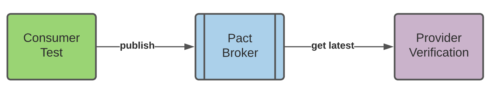
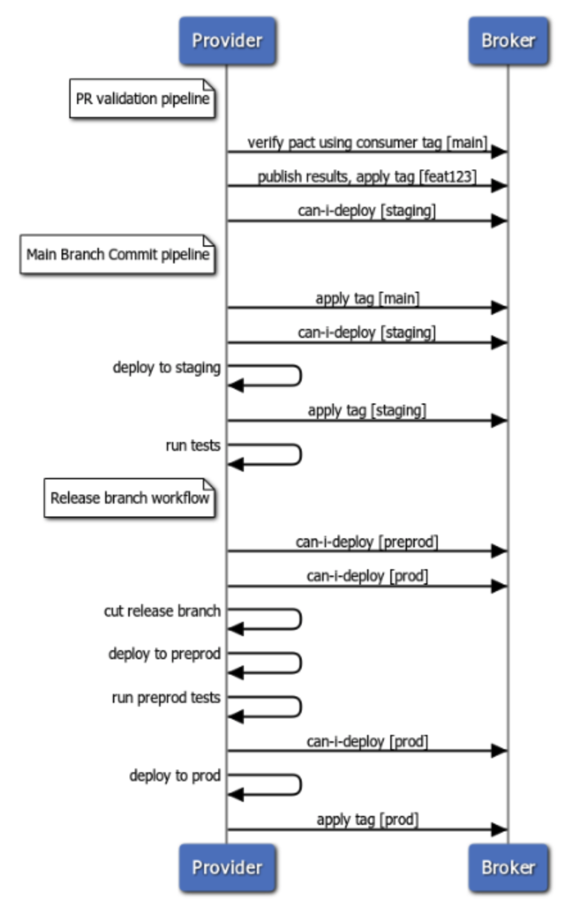

In this document, we walk through small, achievable steps to get yourself to the first contract test running as part of your ongoing CI/CD workflow.

This page doesn't go into the details of how to write and run consumer tests or provider verification tests. 
Here we are laying out a high-level strategy for how you can get Pact set up and operational.  Each of the levels 
below gets you a step towards having a fully automated the process of verifying contracts as 
part of CI/CD with no need for an integration environment.

Right now this guide focuses on the scenario where the consumer and provider are both being deployed to an environment 
rather than released to customers (e.g. a mobile app).

That workflow is slightly different, and that guidance will be coming soon.

This guide also doesn't address how to work with functionality that is behind a feature flag, and how to work with that.  Also coming soon.

## Get prepared: learn about Pact

Before you get going on this, read the Pact Conceptual Overview and go to the Pact documentation to learn more about Pact

## Start your engines: get team alignment

Contract tests are a big win when it comes to enabling teams to work and deploy independently, but they also require 
some level of coordination. Consumer contract tests are of very little value unless they're verified against the 
provider, and a provider can't write contract tests for their system without working with the consumer team to get 
the tests added to the consumer project.

Ideally, both teams are motivated and have time and resources to do the work. However, that may not always be the case. 
So you may reach an agreement where one team adds test code to the other team's project and enhances the 
other team's CI/CD jobs. The project owners can review the changes and discuss intent, but they don't necessarily have to do the work.

So it's good to set up a meeting, discuss the goals and intent, and work out a way where you will work together on this.

## Bronze level: get a single test working manually

The simplest first step you can take is to write a single consumer test (with no provider state), run it manually, and then verify it manually...

### Write a consumer test with no provider state

Pact is a consumer-driven contract testing framework. That means that the contract is established by the consumer, 
based on their understanding of the interface they're consuming from the provider and their specific needs as a consumer.  
This is actually important and powerful. Too often a provider guesses at what their consumer needs and comes up with an 
API based on that.   When you let the consumers drive the contract, it is much better aligned with their needs.

So you write the consumer test first.  You can read more about consumer tests here.

If you are on the provider team, you don't own this test, although you can work with your consumer team to help them 
write it.  But ultimately the consumer owns these tests and drive the understanding of the contract.

Note that if at all possible this first test should not introduce the complexity of provider states. You can add that as a later step.

### Manually run the provider verification test

When you run the consumer test and it runs successfully, it is going to generate a pact file (for more information you 
can read this overview). This file records a series of interactions where the consumer sends a request and the 
producer returns an expected response.

Now you need to see if the provider behaves as the consumer expects. Ultimately this will happen automatically as 
part of running your provider test suite both locally and in CI/CD. But you can make sure it works correctly before 
setting up all that automation.  What you can do is get the pact file that was generated by the consumer, and 
copy it into a folder that is accessible to the provider.  Then write your provider verification test and configure 
it to point to that pact file.  Then run the test and see if it passes. Usually it won't at the first attempt 
unless you're pretty lucky.  So now you can iterate with the consumer and the provider until the tests pass.

## Silver level: manually integrate with Pact Broker

At this level, you still run on your machine, but you have the consumer test publish its pact to the Pact Broker, 
and manually run provider verification where it gets the latest pact from the broker.

### Manually publish the pact to the Pact Broker

Now that things in are a fairly stable state, you can start taking advantage of the Pact Broker to manage the 
communication between your provider and consumer.

Debug this until it works and looks good.

### Manually verify using the Pact Broker

Now you can see if you can run your provider tests, this time pulling the pact file not from your local filesystem, 
but from the broker. Reconfigure your provider project to get the latest pact for each of its consumers from the broker.

## Gold level - integrate with your PR pipelines

The goal with this level is to add Pact support to your PR pipeline. This ensures that these builds will fail if 
the contract tests or verification tests fail.

However, it does not prevent you from merging or deploying a change that is incompatible with the consumers or 
provider in a particular environment. That comes at the next level, when you add can-i-deploy support.

### Publish the pact from your consumer PR pipeline

If you have done it correctly, then the consumer contract tests should run as part of your regular test run. But you 
still need to modify your PR validation job to publish the pact, correctly identifying the consumer version and apply 
a tag with the PR branch name

### Modify the consumer commit pipeline to tag with master branch

After you have set up the consumer PR pipeline to publish pacts, you need to also modify your consumer's main 
branch commit pipeline to indicate that a particular consumer version is now in the main branch.

### Add a step at the beginning of the pipeline to apply the tag with the name of your main branch (e.g. master, trunk or main)

The provider verification needs this information so it can get the latest pact that has been committed to the main 
branch. If it gets the latest pact, it may get a pact that is committed on a feature branch and not ready for verification.

### Verify the pact in your provider PR validation pipeline

One the consumer is publishing its pacts and is tagging them with the correct branch names, you can now add Pact verification and to your provider PR pipeline.

Pact verification should run as part of your regular unit test run. But you should change the tag it verifies against 
to be the name of the consumer's main branch instead of `latest`.

## Platinum level: Add can-i-deploy with branch tag to PR pipelines
Before we merge a PR, it would be good to know if this change is compatible with the consumers and/or providers 
the application talks to.

We can answer this question using the can-i-deploy feature of Pact.

Ultimately, we will want to ask if you can deploy to a particular environment. But a good first step in that direction 
is to just make sure your change is compatible with what your consumers and providers have currently checked into their main branch.

This is a great step, but it's not fully what we want. It's quite possible that the pact version used by the application 
checked into the main branch is not the same as the pact version running in production or even staging.  The more 
frequently you deploy, and the faster you deploy, the less likely this is, but it's definitely a possibility.

This is much more the case for native apps, where you will likely have many old pact versions running on user's 
mobile devices. Any providers those apps talk to need to be compatible with all those versions.

In these cases, checking to see if your provider is compatible with the consumer version checked into main is not 
sufficient. We'll talk about how to check against what is actually deployed in a particular environment in the next section.

### Add can-i-deploy to consumer PR pipeline

This step is a bit tricky.

In your consumer PR pipeline, can-i-deploy with the tag of main will check to see if this consumer has been 
verified against the provider that is currently in the provider's main  branch.

But if your consumer just generated and published a new version of the pact, this will always fail because the 
provider could not possibly have run verification against a newly changed pact.

You avoid this situation by registering a webhook in the Pact Broker that is triggered by the publication of a 
new pact when the verification doesn't currently exist. This webhook calls a job that runs provider verification for the new Pact.

So to get can-i-deploy working in your consumer PR pipeline, you need to follow these steps:

- Create a separate provider verification job that will be called by a webhook. This job takes the consumer's branch name as a parameter.
- Add the webhook in the broker to call this job
- Add the can-i-deploy build step to the consumer PR validation build job

### Add a new provider verification job
This job runs provider verification, taking as a parameter the branch name for the consumer.  You set this up to be 
called through an API call, however your particular CI/CD system supports that.

### Add can-i-deploy webhook to Pact Broker
Once you have the provider verification job set up and working, you can integrate it with the Pact Broker by creating a webhook.

After setting up the webhook, add `can-i-deploy` to your consumer job

## Diamond level - Add Pact to your deploy pipelines

Now we're ready to tag pacts when we deploy, and switch `can-i-deploy` to use environment names rather than branch names.

Note how in the PR pipeline we are checking to see if we can deploy to all the environments that we deploy to from 
the main branch. The rationale for this is that we don't want to merge something into our main branch which we know 
will break once we deploy - we want our main branch to stay clean and not get blocked by broken builds.  If you 
deploy to other environments such as preprod, you would want to check that environment as well.

Then, when we're actually ready to deploy to an environment, we check again. We do this because the version of the 
other side of the contract could have changed since the PR validation ran.  Doing the check in the PR pipeline 
reduces the chance of breakage, but it's still a possibility, and we want to check for that before we deploy.

Note also that the first step in our commit pipeline is to let the broker know that a particular version of the 
provider or consumer is now in the main branch.

### Add tagging to your commit pipelines

The first step is to start tagging when the consumer or provider is deployed to an environment. So when you successfully 
deploy to staging, apply the staging tag; when you successfully deploy to prod, apply the prod tag. Do this for each 
environment you deploy to. 

### Add can-i-deploy to your commit pipelines

Once you have successfully run your pipeline with the tagging, you can safely add `can-i-deploy` checks before you 
deploy to an environment, to make sure it's safe to deploy.

### Add can-i-deploy to environments to your PR pipelines

The final step is to make sure before you merge a PR that you can successfully deploy to all the environments that are 
targeted from the main branch (staging, prod, preprod, etc.)

### What if we use a release branch?

If you use a release branch, then you do not deploy to prod and preprod from your main branch, so you can eliminate 
that check on the PR pipeline.

However, before you cut a release branch, you want to check if you can deploy to preprod and prod.

The general idea is:

- check if you can deploy to an environment before you commit a change to the branch it is deployed from
- check again if you can deploy to an environment just before you actually deploy to that environment.

It might look something like this:

### Modify can-i-deploy in your consumer and provider PR validation pipelines

Now that you are tagging your provider with the environment it is deployed to, you can modify your PR pipeline to 
ask if you can deploy to the environment tag, rather than to the main branch tag.

Congratulations! You have fully operationalized Pact!

## Extra Credit - Add provider state

Now would be a good time to add provider state to your consumer test and make sure you can support this in your provider verification tests.

## Honors Course - Pending Pacts
## Honors Course - Verifying Pacts that are Works in Progress
## Honors Course - Working with Feature Flags

