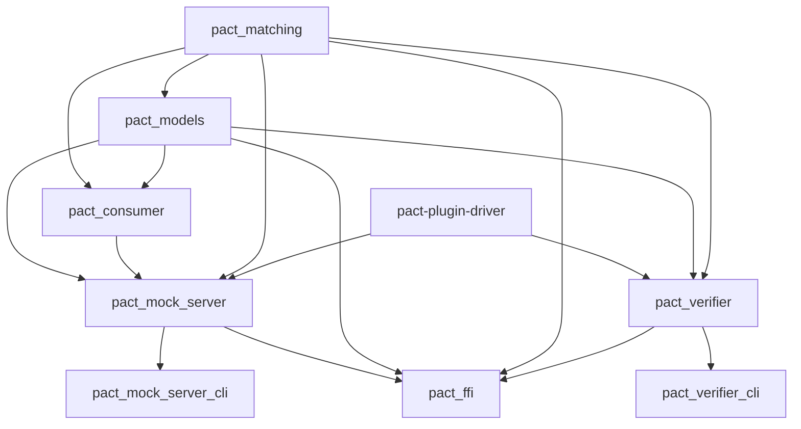
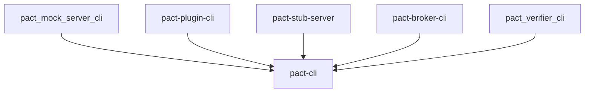
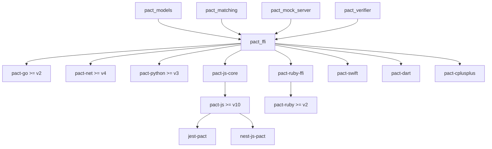
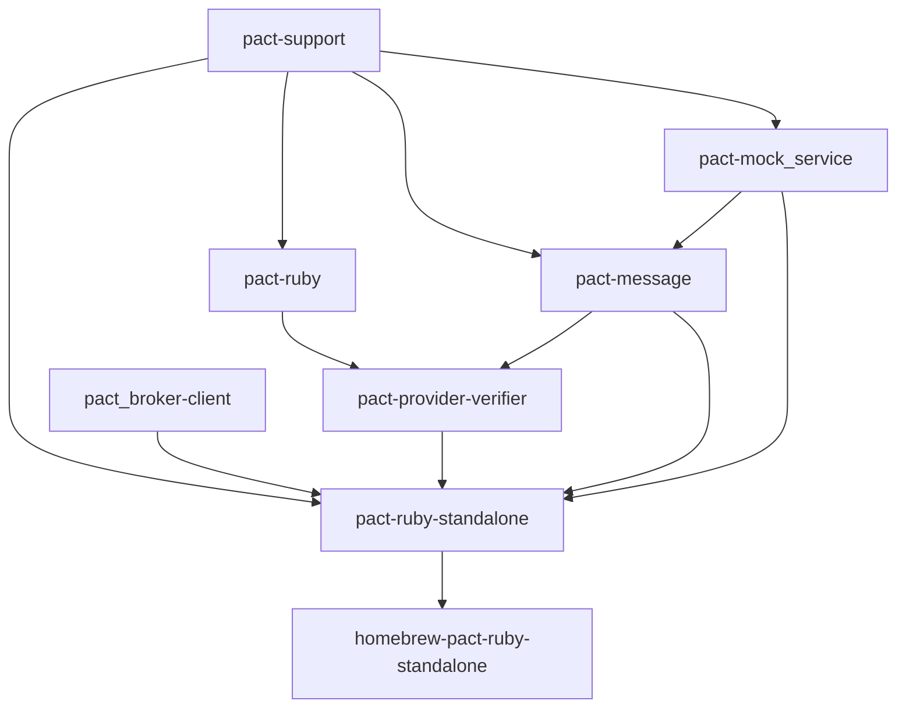
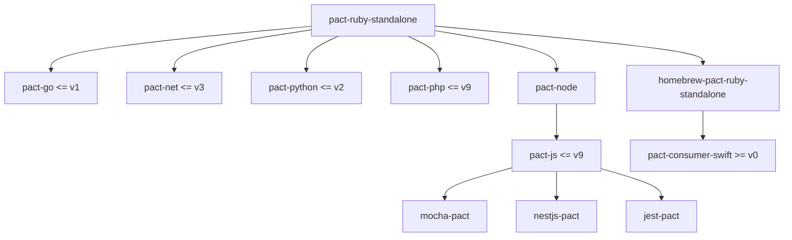

## Background

One of the strengths of Pact is its specification, allowing anybody to create a new language binding in an interoperable way.

To provide a single Pact implementation that could be used by all the required languages, the decision was made to create a reference implementation in Ruby. Wrapping the Ruby implementation allowed new languages to implement Pact quickly, however, it had its downsides.

The standalone package worked by bundling the entire Ruby runtime with the codebase using Travelling Ruby, so it was large **(~9MB)**. The native libraries also had to deal with the mock service process management, which could be fiddly on different platforms. It also made it difficult to run consumer tests in parallel, as each mock service process could only handle one thread at a time.

To provide a single Pact implementation that could be used by all the required languages, the decision was made to create a reference implementation in Rust, that could be wrapped by each client language using FFI. The distributable package will be orders of magnitude smaller, and make it easier to run tests in parallel and avoid the process management issues, we have been slowly moving to our Rust core which solves many of the challenges that bundling Ruby presented.

- 👉 [Try out Pact-JS backed with the Ruby Core](https://killercoda.com/pactflow/scenario/pactflow-getting-started-js)
- 👉 [Try out Pact-JS backed with the Rust Core](https://killercoda.com/pactflow/scenario/pactflow-getting-started-js-v3)

It is worth noting that the "shared core" approach has largely been a successful exercise in this regard. There are many data points, but the implementation of WIP/Pending pacts was released (elapsed, not effort) in just a few weeks for the libraries that wrapped Ruby. In most cases, an update of the Ruby "binaries", mapping flags from the language specific API to dispatch to the underlying Ruby process, a README update and a release was all that was required. In many cases, new functionality is still published with an update to the Ruby binary, which has been automated through a script.

Beth often refers to the Ruby Goldberg machine, in a nod to Rube Goldberg.

We want to bring efficiencies to our CI/CD processes used in our open source projects, so in order to help you navigate the Pact estate, we've created some diagrams, and links to relevant sources, so you can contribute to the Pact ecosystem, no matter [how small](https://github.com/pact-foundation/pact.io/pull/135), or [how big](https://github.com/pact-foundation/pact-ruby-standalone/pull/105) the change.

## Rust Goldberg machine

- [pact_consumer Toml File](https://github.com/pact-foundation/pact-reference/blob/master/rust/pact_consumer/Cargo.toml)
- [pact_ffi Toml File](https://github.com/pact-foundation/pact-reference/blob/master/rust/pact_ffi/Cargo.toml)
- [pact_matching Toml File](https://github.com/pact-foundation/pact-reference/blob/master/rust/pact_matching/Cargo.toml)
- [pact_mock_server Toml File](https://github.com/pact-foundation/pact-core-mock-server/blob/main/pact_mock_server/Cargo.toml)
- [pact_mock_server_cli Toml File](https://github.com/pact-foundation/pact-core-mock-server/blob/main/pact_mock_server_cli/Cargo.toml)
- [pact_models Toml File](https://github.com/pact-foundation/pact-reference/blob/master/rust/pact_models/Cargo.toml)
- [pact_verifier Toml File](https://github.com/pact-foundation/pact-reference/blob/master/rust/pact_verifier/Cargo.toml)
- [pact_verifier_cli Toml File](https://github.com/pact-foundation/pact-reference/blob/master/rust/pact_verifier_cli/Cargo.toml)
- [pact-broker-cli Toml File](https://github.com/pact-foundation/pact-broker-cli/blob/main/Cargo.toml)
- [pact-cli Toml File](https://github.com/pact-foundation/pact-cli/blob/main/Cargo.toml)

### Rust CLI Consumers Goldberg machine

### Rust FFI Consumers Goldberg machine

## Java Goldberg machine

## Ruby Goldberg Machine

This is now considered the "legacy" Pact core implementation, we record here where consuming languages stopped using the Ruby core, and moved to the Rust core described above

### Ruby Standalone Consumers Goldberg Machine

This is now considered the "legacy" Pact core implementation, we record here where consuming languages stopped using the Ruby core, and moved to the Rust core described above

