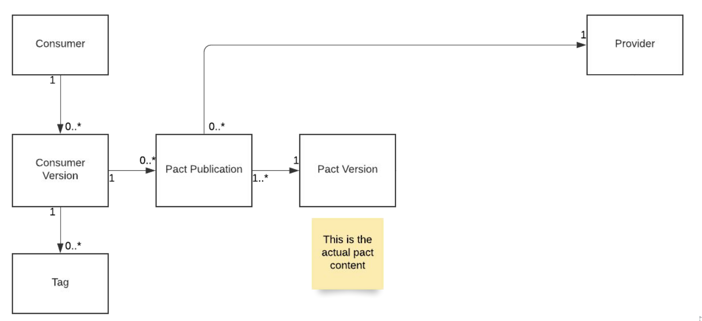
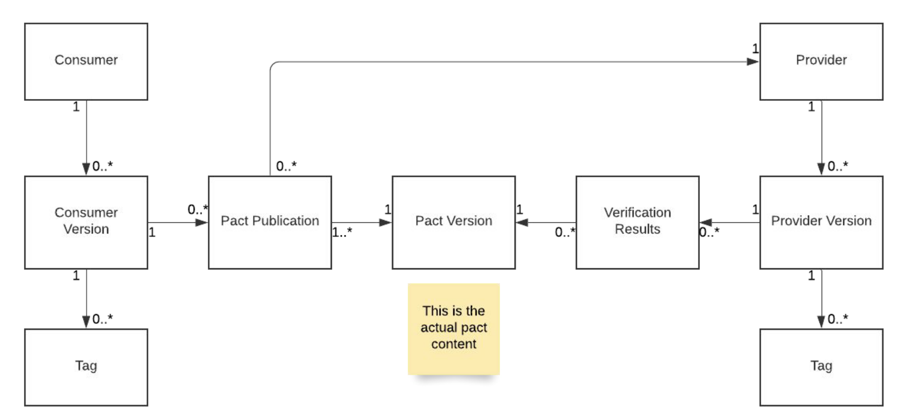
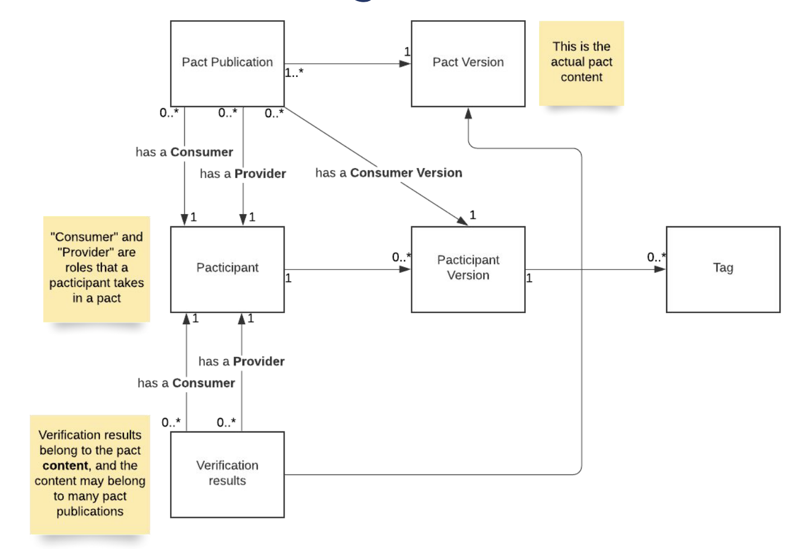

# Conceptual Overview

Using Pact successfully requires you to understand how Pact works and the concepts and terminology behind Pact.
If you try to build your CI/CD without this foundational understanding, you may find yourself getting confused or getting unexpected results.

## Consumers and publishing pacts

Whenever a consumer runs a contract test for a particular provider and it succeeds, a file is generated that records
all of the interactions between the consumer and the provider. This record is called a pact.

In your CI/CD environment, every time you run the contract tests, the resulting pact will be published to the Pact Broker.
This is called a pact publication.

Whenever the consumer changes, this is called a __consumer version__. The version is often identified by its git hash.
You may also want to add other distinguishing information, such as the feature toggle name if you are using feature
toggles or feature branches, if you are using feature branches.  In general, you should be uniquely identify each version of the consumer that may be deployed to an environment which may require a different contract.

A given pact published by the consumer may or may not change actual contents of the pact (e.g. by adding a request
parameter, or changing the expected results).  If it does change, then the pact gets a new __pact version__.

It's important to understand a few rules about how consumers relate to pacts:

- Multiple versions of the consumer can have the same pact version (if the changes to the consumer don't change the pact)
- A specific version of the consumer will always have exactly one pact version for each provider.

## Branches & Environments

:::info THE GOLDEN RULE
associate with the unique application version identifier (usually a git commit sha) and branch name when you publish pacts or verification results, and record deployment with the environment name after you deploy.

- [branches](/pact_broker/branches)
- [recording deployments and releases](/pact_broker/recording_deployments_and_releases)

:::

Branches in the Pact Broker are designed to model repository (git, svn etc) branches. A branch in the Pact Broker belongs to an application. A branch may have many application versions, and an application version may belong to many branches (but typically, it will belong to just one).

> _note_: if you are using feature toggles or other configuration systems that change the behavior depending on a configuration. The same commit in a repository may interact with different versions of a pact, and therefore require different pacticipant versions

The general recommendation is to set the branch name when you publish a pact, and set with the environment when you deploy.

I'll discuss later how we use branches and environments to help answer the question: can I deploy?

For example, let's say you have a PetStoreConsumer application.  Every time you change it that's a new version
of the application.  When you run contract tests for that version, you publish a new pact publication to the broker,
which may or may not generate a new pact version.

| Date  | Consumer Versions | branches     | environment | Pact Version |
| ----- | ----------------- | ------------ | ----------- | ------------ |
| 12/21 | 63be8b            | main         | production  | 1            |
| 12/22 | 9ecb61            | main         | staging     | 2            |
| 12/23 | 31696e            | feat-xyz     | N/A         | 2            |
| 12/23 | 3b4de7            | feat-abc     | N/A         | 3            |

Here we see that:

- Version 63be8b is deployed to prod and is in the main branch.
- Version 9ecb61 is deployed to staging, and is also in the main branch. It has changed the pact, so it has a new pact version.
- Version 31696e is in a feature branch and has not been deployed anywhere. It did not change the pact, so the pact version remains the same
- Version 3b4de7 is in a different feature branch. It did change the pact, so we now have a new pact version

## Verifying the pact

We need to know if a particular pact version will work with a particular version of the provider. This is done by running
a verification, where Pact replays the interactions against the provider and ensures that the providers responses match the consumer's expectations recorded in the pact.

In our CI/CD environment, every time we run a verification, the results will be published to the Pact Broker. This is called a __verification result__.

Whenever the provider changes, this is called a __provider version__ (recommended to be identified by its git hash and git branch plus other identifying information like a toggle name).

Just as with a consumer, you should associate a particular version of the provider with one or more branch.

For example, you should associate the provider with its current branch (e.g. a PR branch or the main branch).
The general recommendation is to associate the branch name when a verification passes, and record a deployment to environment name (like "prod" or "staging") when the provider is deployed to that environment.

Let's expand the example from above to include the provider and its verifications.

| Date  | Provider Version | branches     | environment | Verified against pact versions |
| ----- | ----------------- | ------------ | ----------- | ------------ |
| 12/21 | 6464f9            | main         | production  | 1,2            |
| 12/22 | a8513e            | main         | staging     | 1,2,3           |
| 12/23 | 35a850            | feat-xyz     | N/A         | 2,3            |
| 12/23 | 741a54            | feat-abc     | N/A         | 3            |

Note that provider version 35a850 in the feat-X branch has not been verified against pact version 1. Because that's the
version that the production consumer is at, it is not safe to deploy this version of the provider to production. You probably
also don't want to merge it into main until this gets fixed. Similarly provider version 741a54 has only verified
pact version 3. So it's not safe to deploy to either staging or prod, and should definitely not be merged to main.

## Generalizing: the pacticipant

We have generalized the "consumer" and "provider" roles of a pact using the term __pacticipant__. A particular
pact publication has two pacticipants: the consumer and the provider.  A verification result also has two
pacticipants: the consumer and the provider.

This generalized concept of a pacticipant can be useful because sometimes you can perform the same operations on a
pacticipant regardless of whether it is a consumer or a provider.
