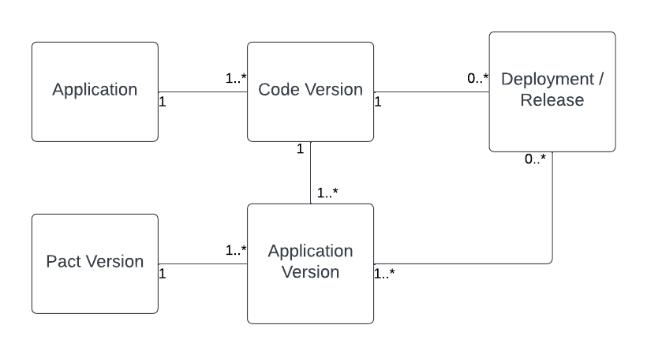
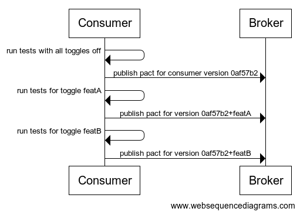

# Working with feature toggles and configurable behavior
Normally we think that a particular version of our code is attached to only a single version of a pact.

But when you introduce configurability, such as with feature toggles, that is no longer the case.  A team
may be working on a new feature that makes use of a new parameter, a new response, or an entirely new 
endpoint or concept in a contract with a provider.

Before you turn that toggle on in a specific environment, you want to know whether it's going to work.

# One code version, multiple application versions
One of the great tools of feature toggles is that you can target the toggle to a subset of your users. If a
team is working on a new feature, they may want to turn it on just for the product team, or for a select set
of early adopters. Very often you want to roll it out slowly across your user base and keep an eye on your
application and business metrics.

This essentially means that a _single deployment or release of your software contains multiple versions of your
application_. This is not always easy to get your head around, but it's very important to understand.

The implication of this is that a given deployment or release may use or need to support multiple versions of 
a pact between a consumer and a provider.

# Identifying versions
With this in mind, it becomes clear that using the git hash (which represents the code version) to version
an application for Pact may not be sufficient. If your application can consume or provide different versions
of the same pact with the same code version, you need to provide a version identifier that is unique for each specific
version of a pacticipant that the code supports.

Let's define an "active feature toggle" as one that could potentially be turned on in a particular environment.

If you have a single active feature toggle that can be on or off, say `featA`, this is simple enough.  You would 
create a version identifier which is the code hash + a unique feature identifier, say `ef567ab+featA`. You would also
have a "base" version identifier for when all toggles are off, which would just be the git hash, or `ef567ab`.  We
will call the base identifier the _base version_, and the identifiers with toggles turned on _toggle versions_.

However, you likely will have multiple features under active development.  The code will behave slightly 
differently for each possible combination of feature toggles. If you have ten different active feature toggles, 
that would be 10! or 3,628,800 different version identifiers.

So we need to either throw our hands up or find some simplifying assumptions.

First, we only care about which active feature toggles use a different version of the pact.  Secondly,
if we turn on two different toggles at the same time, they are not generally going to change how each one 
interacts with the contract separately. So, except for very rare cases, we don't have to worry about combinations of toggles.

So generally we only need a separate toggle identifier for each active feature toggle we know uses a different version
of the pact from the base version. 

# Consumer workflow with feature toggles

## Running consumer tests and publishing pacts
When it is time to run consumer tests for a given version of the code, we now need to run the tests for
the base version as well as for each toggle version that we know uses a different version of the pact
(for example a toggle that adds a parameter or uses a new API). We then publish the resulting pact
using the appropriate version identifier.

## Marking a consumer with the branch name
After a specific version of the consumer passes consumer tests, we want to mark that version
with the current branch.  For example, if `0af57b2` passes and `0af57b2+featA` passes on
the branch `mybranch`, but `0a5f7b2+featB` doesn't, then we mark `0af57b2` and `0af57b2+featA` with the
branch `mybranch` but not `0a5f7b2+featB`.

You can decide on your policy if some but not all the toggles pass for a given code version.  You may decide
it's ok to merge the code into your main branch as long as the base version passes, and you will prevent failed
toggle versions from being turned on. Or you may decide all toggle versions have to pass before you can merge.

# Provider workflow with feature toggles

# Running provider verification for new pact versions
When a consumer publishes a new version of a pact, we want to trigger a provider verification for that version.

OPEN QUESTION: are we supposed to run verification for each provider feature toggle that changes the behavior
of the contract? 

# Rolling out code
For simplicity's sake, we will call both deploying a version to a runtime environment or releasing code to customers
as a _rollout_.

## Marking a version as deployed or released to an environment
The whole point of feature toggles is to be able to roll out features independent of a code rollout. So with this
in mind, we may want to implement a process where a particular toggle version isn't marked as rolled out to an
environment when the code is rolled out. Instead, we only mark the base version with that environment name.

However, as soon as we turn on the feature for even a subset of users, we need to mark that toggle version
with that environment name. Otherwise we may think it's safe to roll out a version of the pacticipant which  
is incompatible with that toggle version.

Ideally we have a controlled, automated process for rolling out a feature toggle to a particular environment.
With that in place, we can add a new automated step where we mark that toggle version with the environment name.
We could also add automation to remove that toggle version from the environment name when the toggle is turned off.

If we instead have a system where a toggle can be turned on manually, it may be safer to mark all toggle
versions with the environment name when the code is rolled out.

Note that we need to mark a toggle version with an environment name when it is on for any segment of users, 
no matter how small.  

NOTE: because we can have multiple active versions in the same environment, you will need to change your
uses of `record-deployment` to `record-release`.

## Checking if you can turn on a feature toggle in an environment
Prior to turning on a feature toggle in an environment, we want to make sure it's safe and won't break a contract.

This is done with `can-i-deploy`, but our previous assumption that we can just look at the latest version of a 
consumer or provider marked with that environment name no longer holds.  There can be multiple active versions
in an environment - the base version for sure, but also a toggle may be turned on for some segment of users in
that environment.

If you are using tags, you can check for all versions marked with a given environment using the `--all TAG` option.

If you are using `record-release`, you can just allow the Pact Broker to 
[automatically determine the dependencies](https://docs.pact.io/pact_broker/client_cli/can_i_deploy_usage_with_tags#recommended-usage---allowing-the-pact-broker-to-automatically-determine-the-dependencies)
by using the `--environment <environment-name>` option

By using `-all TAG` or `--environment`, the Pact Broker will check all active versions for that environment,
and `can-i-deploy` will pass only if all of them have been verified successfully.

## Turning off a feature toggle in an environment
One of the challenges of feature toggles is feature toggle management. These toggles can pile up and become
technical debt.

Most teams using feature toggles build a policy whereby once a toggle is fully rolled out, they remove the 
use of the toggle from their code.

As you roll out the code where the toggle has been removed, you will want to have a process to remove the toggle
from the environment.

If you are using tags, you can use the [Pact REST API to delete the tag](https://docs.pact.io/pact_broker/tags#deleting-tags)

If you are using `record-release` then you can use the [`record-support-ended` command](https://docs.pact.io/pact_broker/recording_deployments_and_releases#recording-support-ended-for-a-release)
