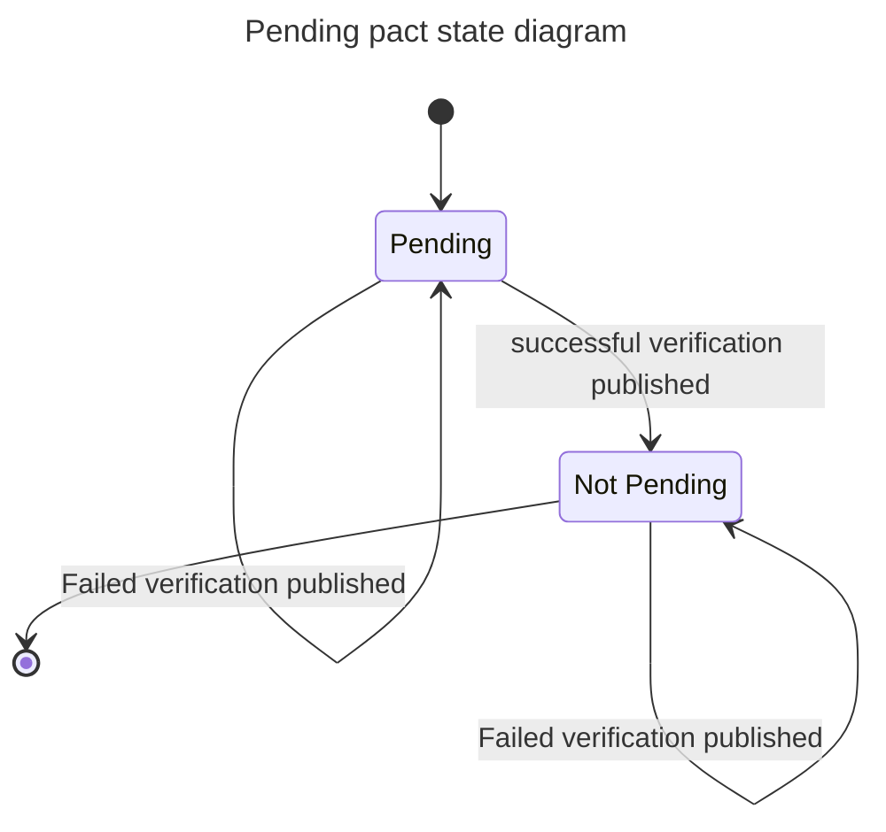

:::info what do I need to know?

Enabling the "pending pacts" feature ensures the pact verification task (and therefore, the build) only fails when a breaking change causes a previously supported pact to fail verification. Without the feature enabled, *any* failing pact (eg. ones with new features) will cause the provider's build to break, blocking the provider from deploying even if it is compatible with its deployed consumers.

[Watch a video that explains this concept](https://youtu.be/VnOy9Sv9Opo).

The logic for the "pending pacts" feature is quite technical and you don't need to understand it to use it. The takeaway from this intro for new Pact users should just be: "enable the 'pending pacts' feature, and the build will only fail when it needs to prevent a breakage to an existing integration."

You can enable the pending pacts feature by setting `enablePending` (or equivalent for your language) to `true` in the [provider verification configuration](/provider/recommended_configuration#verification-triggered-by-provider-change). In the future, this feature will be enabled by default.
:::

:::tip tl;dr - As a provider, protect your builds by enabling pending pacts

- Ensure consumer has configured the mainBranch property
- Ensure consumer sets branch and version properties when publishing pacts
- Ensure provider sets branch and version properties when verifying pacts
- enable the pending pacts feature by setting `enablePending` (or equivalent for your language) to `true` in the [provider verification configuration](/provider/recommended_configuration#verification-triggered-by-provider-change)
:::

## Why is this feature required?

Without the pending pacts feature turned on, changes made to pacts by the consumer team can block the provider team from being able to deploy, even when the provider is compatible with the deployed version of the consumer.

To demonstrate how it works, let's compare an example workflow with and without the "pending" feature enabled. Note that the pending feature is only applicable to the main provider release pipeline, not the provider build that gets triggered by the `contract_requiring_verification_published` webhook.

### Without the pending pacts feature enabled

1. Provider is configured to verify the pacts with following consumer version selectors.
   1. `{ mainBranch: true }` and `{ deployedOrReleased: true }`,
   2. `enablePending` option is set to `false`.
2. Provider build runs, both retrieved pacts (the consumers `main` branch pact, and the consumer pact deployed to `production`) are currently passing verification from the `main` branch of the provider.
3. Consumer publishes a pact against the branch `main` that has a new, unsupported interaction in it (ideally, this should have been done in a feature branch, but for the sake of this example, we'll assume best practice advice was not followed).
4. Next time the provider build runs,
   1. the verification of the consumers configured `main` branch pact fails,
   2. **AND** *because `enablePending` is turned off, **the verification task exits with an error***.
   3. The broken build stops the provider from deploying, even though the verification for the `deployedOrReleased` consumer pact in `production` passed.
5. The provider team is very annoyed!

### With the pending pacts feature enabled

1. Provider is configured to verify the pacts with following consumer version selectors.
   1. `{ mainBranch: true }` and `{ deployedOrReleased: true }`,
   2. `enablePending` option is set to `true`.
2. Provider build runs, both retrieved pacts (the consumers `main` branch pact, and the consumer pact deployed to `production`) are currently passing verification from the `main` branch of the provider.
3. Consumer publishes a new pact against the branch `main` that has a new unsupported interaction in it (ideally, this should have been done in a feature branch, but for the sake of this example, we'll assume best practice advice was not followed).
4. Next time the provider build runs,
   1. the verification of the consumers configured `main` branch pact fails
   2. **BUT** *because `enablePending` is turned on, **the verification task does not exit with an error***.
   3. This means the pipeline continues and the provider can still deploy to production, because the verification for the `deployedOrReleased` consumer pact in `production` passed.
5. Provider team is happy!

Note that in both of these examples, the verification result sent back to the Pact Broker for the consumers `main` pact is still a failure, and the consumer cannot be deployed in either example, as the features it requires are not yet supported (this is why a feature branch should have been used, as the consumer's own pipeline will be blocked by `can-i-deploy` reporting that the provider does not yet support the new interaction).

[Watch a video that explains this concept](https://youtu.be/VnOy9Sv9Opo).

## How the "pending" feature works

### Purpose

The purpose of the pending feature is to ensure that provider builds are not broken by changes that were introduced by the consumer, but to also ensure that backwards compatibility is maintained when a change is introduced by a provider. It achieves this by treating the first successful verification of a pact version by a particular branch of the provider as an implicit acceptance of the contract. Thereafter, if a verification of that pact version fails, it can only be because the provider has made a backwards incompatible change.

### How the feature is enabled

The feature is enabled by setting `enablePending` (or `enabled_pending` or `EnabledPending` depending on your language) to `true` in the provider verification configuration (consult the provider verification configuration docs for your language.) In the future, this feature will be enabled by default.

### How it is calculated

The "pending" status of a pact is a *dynamically calculated* property, determined by the Pact Broker when the pacts are fetched for verification. It is based on:

- The content of the contract (also known as the "pact version").
  - Note that the Pact Broker deduplicates and versions the contents of the published pacts. Publishing the same content for multiple consumer versions results in each of the consumer versions being associated with the same underlying pact content version.
- The verification results and their associated branches that have been published to the Pact Broker for the pact content.
  - Note that the verification results belong to the pact *content* itself, irrespective of which consumer version published it.
- The currrent branch of the provider, as specified by the provider branch property in the verification configuration

**A pact's content is pending for all branches of a provider until the first successful verification has been published. From then on, it is no longer pending for the provider branch that published the successful verification, and will not be pending for any other new provider branches created thereafter. It will stay in pending for branches that already existed at the time of the successful verification.**

The provider branch is used to determine the pending status because it is common to implement new features of a provider on a feature branch. If the provider branch was not taken in to consideration, a newly published successful verification on `feat-x` branch of the provider would suddenly cause the verification of that content by the `main` branch of the provider to fail.

This diagram, while not entirely accurate (there is no stored state, it's a dynamic calculation) is a helpful way of understanding the pending state transitions for a pact version and a particular provider branch.



### How it is used

The value of the "pending" property is used by the pact verification task to determine whether or not to exit with an error status for a failed pact.

When a pact version is considered "pending", then any mismatches during verification *will not* cause the overall verification task to fail. When a pact is *not* considered "pending" then mismatches *will* cause the overall verification task to fail (until the introduction of this feature, this was the default behaviour).

While the provider build may pass, the verification results are still reported (if results publishing is enabled) to the Pact Broker as "failed", as the consumer should not be able to deploy the code that generated this contract.

The pending property *is not used* by the pact verification build that is triggered by the `contract_requiring_verification_published` webhook, but should be set to `enablePending: true` for regular provider builds, as described above. This is because the pending status of the pact content is calculated based on the branch that the provider will use to publish the verification results, and the `contract_requiring_verification_published` event is triggered for the providers `HEAD` of the configured `mainBranch` property, and any deployed or released versions of the provider. The webhook triggered build is meant to be an "out of bound" build that does not have any dependencies on it, and it is expected to fail when pacts change. This is why it is essential to `enablePending:true` on builds where the Pact verification task, run when provider codebase changes.

For those still using the deprecated `contract_content_changed` event.

The pending property *is not used* by the pact verification build that is triggered by the `contract_content_changed` webhook. This is because the pending status of the pact content is calculated based on the branch that the provider will use to publish the verification results, and the `contract_content_changed` webhook cannot know this information. The webhook triggered build is meant to be an "out of bound" build that does not have any dependencies on it, and it is expected to fail when pacts change.

### WIP pacts

[Work in progress pacts](/pact_broker/advanced_topics/wip_pacts) always have the pending flag set to true.

## Examples

Let's walk through the "pending" lifecycle of a particular pact content version with an interaction that is implemented directly on the `main` branch of a provider.

1. Provider is configured to verify the pacts with following consumer version selectors.
   1. `{ mainBranch: true }` and `{ deployedOrReleased: true }`,
   2. `enablePending` option is set to `true`.
2. Provider build runs, both retrieved pacts (the consumers `main` branch pact, and the consumer pact deployed to `production`) are currently passing verification from the `main` branch of the provider.
3. Consumer publishes a new pact with for the branch `main` that has a new unsupported interaction in it.
4. Next time the provider build runs, the `main` pact is returned for verification with `pending: true`.
   1. The verification fails. The status is reported back to the Pact Broker as failed, but the verification task does not exit with an error.
   2. Provider is able to deploy to production because the `production` pact passed.
5. Provider implements the new feature on the `main` branch
   1. When the pipeline runs, the `main` pact passes
   2. A successful verification from the `main` branch of the provider is published.
   3. This successful verification means this pact content will now be `pending: false` for all future verifications by the `main` branch.
6. Next time the provider pipeline runs, the `main` pact is returned for verification with `pending: false`.
   1. The verification for the `main` pact still passes, so everything is still green.
7. A regression is made in the provider, and when the pipeline runs, the `main` pact is again returned for verification with `pending: false`.
   1. This time, when the verification fails, the verification task exits with an error, and the provider cannot deploy, as they have introduced a bug that breaks a previously supported pact.

This time, let's walk through the lifecycle of a pact content version with an interaction that is implemented on the branch of a provider.

1. (As above) Provider is configured to verify the pacts with following consumer version selectors.
   1. `{ mainBranch: true }` and `{ deployedOrReleased: true }`,
   2. `enablePending` option is set to `true`.
2. (As above) Provider build runs, both retrieved pacts (the consumers `main` branch pact, and the consumer pact deployed to `production`) are currently passing verification from the `main` branch of the provider.
3. (As above) Consumer publishes a new pact with branch `main` that has a new unsupported interaction in it.
4. (As above) Next time the provider build runs, the `main` pact is returned for verification with `pending: true`.
   1. The verification fails. The status is reported back to the Pact Broker as failed, but the verification task does not exit with an error.
   2. Provider is able to deploy to production because the `production` pact passed.
5. Provider implements the new feature *on a feature branch*, `feat-x`
   1. When the pipeline runs, the `main` pact passes
   2. A successful verification from the `feat-x` branch of the provider is published.
   3. This successful verification means this pact content will now be `pending: false` for all future verifications by the `feat-x` branch.
6. Next time the `feat-x` provider pipeline runs, the `main` pact is returned for verification with `pending: false`.
   1. Any verification failures for that content from now on will cause the `feat-x` build to fail.
7. Next time the `main` provider pipeline runs, the `main` pact is still returned for verification with `pending: true`.
   1. This is because the `main` branch of the provider has still not verified the `main` pact yet.
8. The `feat-x` branch is merged into `main`, and a successful verification for the `main` pact is published.
   1. This successful verification means this pact content will now be `pending: false` for all future verifications by the `main` branch, and any verification failures will break the build.

## To start using the Pending pacts feature

- You need to either be using [pactflow.io](https://pactflow.io?utm_source=ossdocs&utm_campaign=pending_pacts), or have version 2.60.0+ of the OSS Pact Broker.
- You need to be use at least the following version of your Pact library:
  - JVM: 4.1.7
  - For the following libraries that wrap the [pact-ruby-standalone](https://docs.pact.io/wrapper_implementations), at least version 1.49.3 of the standalone is required.
    - JS: 9.11.1 (not supported by the v3 implementation that uses Rust)
    - Ruby: 1.52.0
    - Go: latest as of September 2020 (v1.4.1)
    - .Net: latest as of September 2020 (version TBC)
    - Python: latest as of September 2020 (version TBC)
- You need to find the verification documentation for your language, and set the "enablePending" flag to true.

## FAQ

### How can I try this out?

There is a CI/CD workshop [here](https://docs.pactflow.io/docs/workshops/ci-cd/) that walks you through the steps of setting up a CI/CD pipeline, using Travis CI and a pair of Node applications. The step entitled [Protecting the provider](https://docs.pactflow.io/docs/workshops/ci-cd/workshop/protecting-the-provider/) walks you through an example that you can try out yourself.

### I've enabled the pending feature. Why are my verification results recorded as failed in the Pact Broker, when my provider CI is passing?

This is the way it's meant to work. The pending flag doesn't make the failing verifications pass. It just changes the exit code of the verification task so that the provider build doesn't fail. The failed verification results need to be sent back to the Broker so that the consumer knows that they can't deploy that code yet.

### Why has my master build suddenly failed when a successful verification was published from a branch?

The pending flag is calculated based on the provider branch property supplied. You probably haven't configured a provider branch in the providers verification setup options, so the results from the branch and master can't be differentiated.

### Why is the pending configuration not working for my `contract_requiring_verification_published` webhook triggered build?

The pending feature is only applicable to the [provider changed workflow](/pact_nirvana/step_4#d-configure-pact-to-be-verified-when-provider-changes), where the list of pacts to be verified are fetched from the Pact Broker. It does not apply to the [contract changed](/pact_nirvana/step_4#e-configure-pact-to-be-verified-when-contract-changes) workflow where the pact URL, provider branch and commit sha is passed to the job via the webhook, for each of the providers configured `mainBranch` and any `deployedOrReleased` versions. This is because the pending status of the pact content is calculated based on the branch property that the provider will use to publish the verification results, and the `contract_requiring_verification_published` webhook cannot know this information. The webhook triggered build is meant to be an "out of bound" build that does not have any dependencies on it, and it is expected to fail when pacts change.

### Why is the pending configuration not working for my `contract_content_changed` webhook triggered build?

The pending feature is only applicable to the [provider changed workflow](/pact_nirvana/step_4#d-configure-pact-to-be-verified-when-provider-changes), where the list of pacts to be verified are fetched from the Pact Broker. It does not apply to the [contract changed](/pact_nirvana/step_4#e-configure-pact-to-be-verified-when-contract-changes) workflow where the pact URL is passed to the job via the webhook. This is because the pending status of the pact content is calculated based on the branch property that the provider will use to publish the verification results, and the `contract_content_changed` webhook cannot know this information. The webhook triggered build is meant to be an "out of bound" build that does not have any dependencies on it, and it is expected to fail when pacts change.

### I'm so confused by the whole thing

The API that returns the list of pacts to verify has some built in messaging to explain what is going on that should be displayed to the user. Here is an example from the Ruby implementation.

```
DEBUG: The pact at https://test.pactflow.io/pacts/provider/Bar/consumer/Foo/pact-version/6c4158b13a7f05dadd208a7633b77d1f299ae375
is being verified because it matches the following configured selection criterion:
latest pact between a consumer and Bar
DEBUG: This pact is in pending state for this version of Bar because a successful verification
result for a version of Bar with branch 'master' has not yet been published.
If this verification fails, it will not cause the overall build to fail.
Read more at https://pact.io/pending

[test output]

DEBUG: This pact is still in pending state for any version of Bar with branch 'master' as a successful
verification result with this branch has not yet been published
```

If you cannot see this debug output, please consult the documentation for your language to see if you can find a way to turn it on. If you can't find that, please hop on to our [Slack workspace](https://slack.pact.io) and ask about it in the appropriate channel for your language.

There is also a [CI/CD workshop](https://docs.pactflow.io/docs/workshops/ci-cd/) that will take you through the process of adding a new feature.
