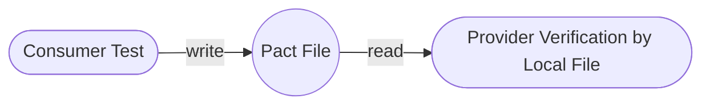
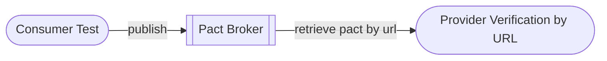
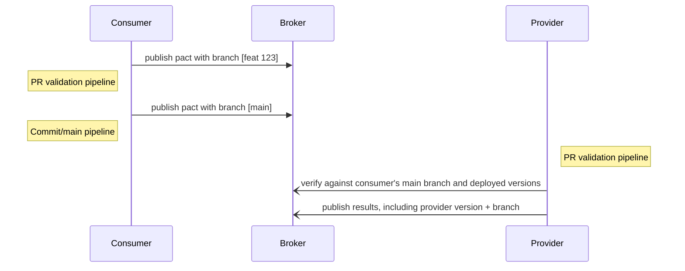
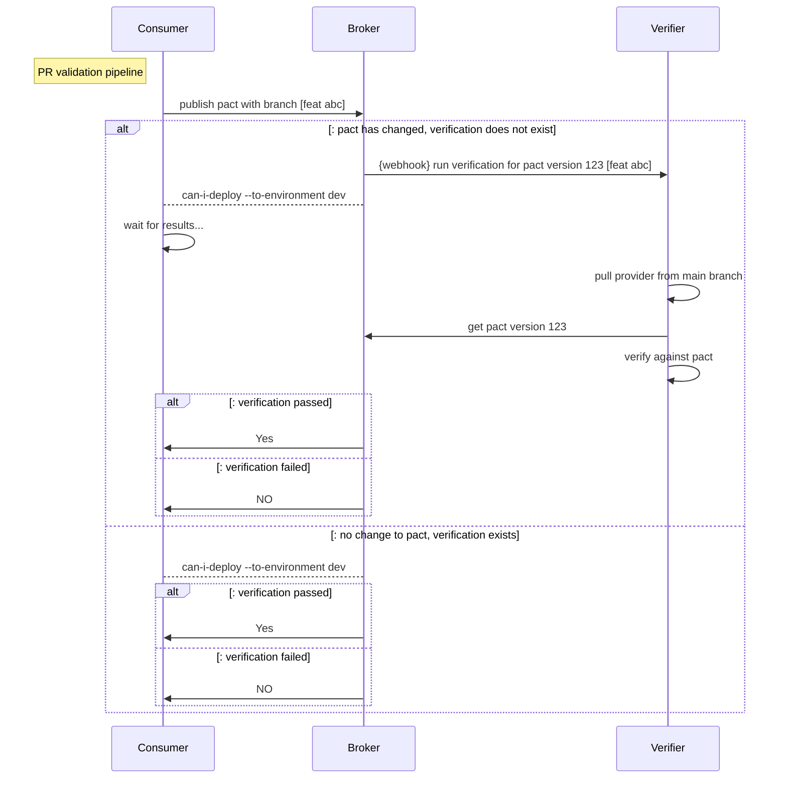
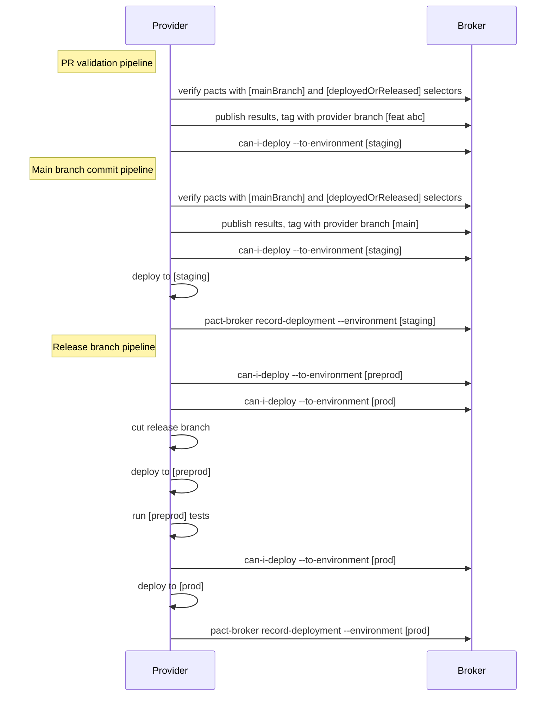

Or _"The steps for reaching Pact Nirvana"_

This is a technical guide for developers and testers who want to use Pact to implement consumer driven contract testing as part of your ongoing CI/CD workflow.

By the end of the guide, you will understand how to create a release pipeline that allows you to independently deploy any application with the confidence that it will work correctly with the other applications in its environment - without having to run a suite of end to end tests.

This guide focuses on the scenario where the consumer and provider are both being deployed to an environment rather than released to customers (e.g. a mobile app). That workflow is slightly different, and that guidance will be coming soon.

### How to use this document

Each integration is different. Each organisation has different history and culture, and each team may have different processes for development, testing, and deployment. Each of these differences affect the best choices for Pact workflow.

However, there are many similarities in the steps necessary on the journey to a full-featured and effective Pact setup \(_"Pact Nirvana"_\). This document describes those steps.

Feel free to pick and choose the steps that apply best to your team. You may implement only the first few steps described below, and just use Pact as a precursor to your standard integration tests; or you may throw away your integration tests altogether and reach "Pact Nirvana".

This guide doesn't go into the details of how to write and run consumer tests or provider verification tests. Here we are laying out a high-level strategy for how you can get Pact set up and operational.  Each of the levels below gets you a step towards having a fully automated process of verifying contracts as part of CI/CD with no need for an integration environment.

As Pact has been implemented in many different languages, this document will outline the theory for each step. You will need to consult the documentation of your chosen language to learn the relevant syntax for each task. See the [implementation guides](/implementation_guides/cli) section for more information.

### What are the steps for reaching Pact Nirvana?

1. Get Prepared - learn about pact
2. Talk: get team alignment
3. Bronze level: get a single test working manually
4. Silver level: manually integrate with Pact Broker
5. Gold level - integrate with your PR pipelines
6. Platinum level: Add can-i-deploy with branch tag to PR pipelines
7. Diamond level - Add Pact to your deploy pipelines
8. Honors Course - To come in future...
   1. Add provider state
   2. Pending Pacts
   3. Verifying Pacts that are Works in Progress
   4. Working with Feature Flags

Click below to expand and see each a diagram representing each level

  
Bronze diagram

  
Silver diagram

  
Gold diagram

  
Diamond diagram

  
Diamond with release branch diagram

