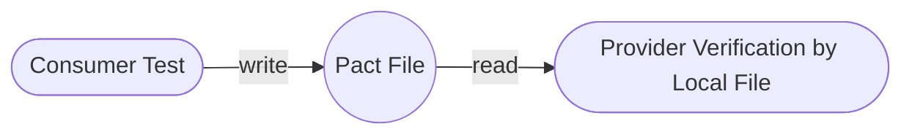

  
Bronze diagram

If you have not used Pact before, consider trying it out on a [spike](https://en.wikipedia.org/wiki/Spike_%28software_development%29) application first.

The simplest first steps you can take

## Tasks

1. Write a Pact test in your consumer project \(consult [the documentation](/implementation_guides/cli) for your chosen language\) and generate the pact.
2. Ship the pact file to the provider team via some manual mechanism (we will introduce the concept of a pact broker in a later step)
3. Verify the pact against the provider \(again, consult the documentation for your chosen language\)
4. Talk about it.
5. Decide whether or not Pact is the right tool for you, taking into account that there are situations for which Pact is [a good solution](/faq/#what-is-pact-good-for), and situations for which Pact is [not a good solution](/faq/#what-is-pact-not-good-for).

### Write a consumer test with no provider state

Pact is a consumer-driven contract testing framework. That means that the contract is established by the consumer,
based on their understanding of the interface they're consuming from the provider and their specific needs as a consumer.
This is actually important and powerful. Too often a provider guesses at what their consumer needs and comes up with an
API based on that.   When you let the consumers drive the contract, it is much better aligned with their needs.

So you write the consumer test first.  You can read more about consumer tests [here](https://docs.pact.io/consumer).

If you are on the provider team, you don't own this test, although you can work with your consumer team to help them
write it.  But ultimately the consumer owns these tests and drives the understanding of the contract.

Note that if at all possible this first test should not introduce the complexity of provider states. You can add that as a later step.

:::info
You can see an example and overview of a consumer test [here](https://docs.pact.io/5-minute-getting-started-guide#testing-the-order-web-consumer-project)
:::

### Manually run the provider verification test

When you run the consumer test and it runs successfully, it is going to generate a pact file (for more information you
can read [this overview](https://docs.pact.io/getting_started/how_pact_works#consumer-testing)). This file records a series of interactions where the consumer sends a request and the producer returns an expected response.

Now you need to see if the provider behaves as the consumer expects. Ultimately this will happen automatically as
part of running your provider test suite both locally and in CI/CD.

There are two types of pact verification that will be performed

1. Pact verification by URL or file path (This will be designed to be triggered by a webhook, when a consumer contract changes)
2. Pact verification by consumer version selectors (This will be designed to run, whenever the provider codebase changes and runs in CI)

You can make sure it works correctly before setting up all that automation.

This step will perform verification type 1, allowing providers to verify pacts from a local file path, or remote URL. This is useful for
debugging or running provider verifications locally, in future.

- get the pact file that was generated by the consumer
- copy it into a folder that is accessible to the provider
- write your provider verification test, configuring it to point to that pact file.
- Then run the test and see if it passes.

Usually it won't at the first attempt unless you're pretty lucky.  So now you can iterate with the consumer and the provider until the tests pass.

### Additional Notes

We also have features such as:

- provider states
- matchers

However before diving in, follow this guide to make sure you understand how the pact generation and verification steps work, these will form part of our Honours course.
