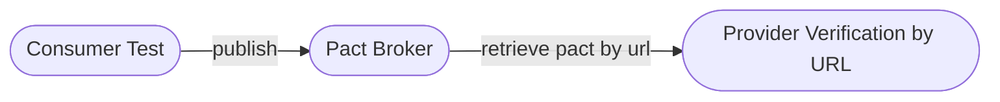
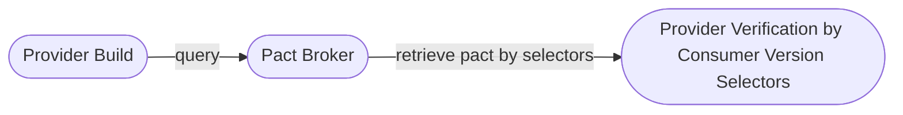
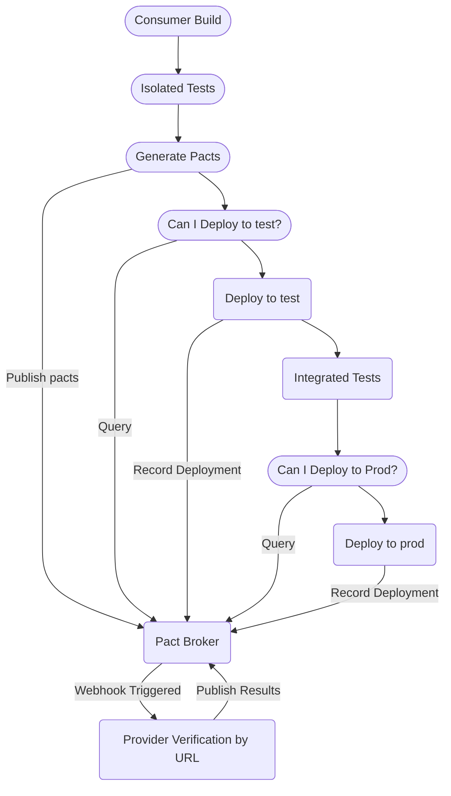
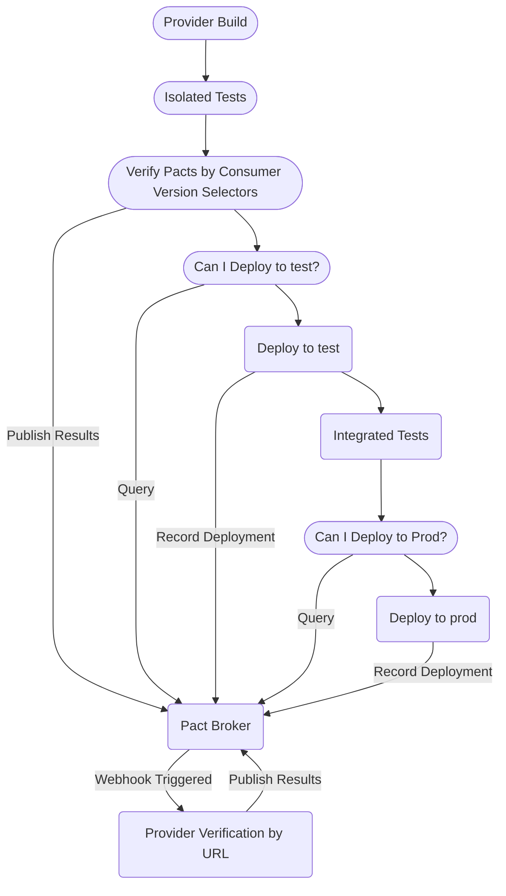

Now you have two different sets of tests in two different codebases. The artifacts that tie these tests together are the Pact file, and the verification results. The next step is to automate the exchange of these artifacts. At this level, you still run on your machine, but you have the consumer test publish its pact to the Pact Broker, and manually run provider verification where we will verify the pact from the broker via URL, rather than pointing to our local file system. We will then create a new verification task, which will retrieve the same pact but via consumer version selectors.

  
Silver diagram

### Verification by Pact Url

### Verification by Consumer Version Selectors

### Sharing the contracts with the provider team via a broker

> Sharing is caring

Now that you have created and run your consumer tests, producing a contract \(the pact file\) as an artefact.
You've shared it with the team responsible for managing the provider manually, and they've confirmed they meet all of the expectations set in it. We need a mechanism to ensure that we can eliminate the manual step of sharing our contracts which will be invaluable as our code changes and evolves.

There are multiple ways to [share pacts](getting_started/sharing_pacts.md), but the recommended approach is to use a Pact Broker which is a service that allows your projects to exchange pacts and verification results in an automated way enabling powerful automation workflows.

There are two flavours.

- The [Pact Broker](pact_broker/)
  - Open Source
  - Self-Hosted
    - Requires you to deploy, administer & host yourself
- The [Pactflow Broker](https://pactflow.io/?utm_source=ossdocs&utm_campaign=five_minute_guide_dev_plan)
  - A commercial extension of the open-source Pact Broker
  - Created by some of the Pact maintainers
  - Provides a fully managed SaaS Pact Broker
  - Comes with some additional features to simplify teams getting started and scaling with Pact.

While you can use Pact without a Pact Broker, using one allows you to get the most out of Pact. Without the Broker, you will have to work out how to create your own feedback loop that lets you know the results of the pact verifications, and your pacts will not enable to you release your services independently and safely using the `can-i-deploy` tool \(more on this later\).

- [Why do I need one?](https://docs.pact.io/pact_broker#why-do-i-need-one)
- [Can I use Pact without a Pact Broker?](https://docs.pact.io/pact_broker#can-i-use-pact-without-a-pact-broker)

This guide assumes you will be using a Pact or PactFlow Broker.

### Verifying pacts

There are two reasons that a verification task will need to be run:

1. When the provider code changes

* The verification task will run as part of the normal CI/CD pipeline for the provider
* The verification task will fetch and verify all the relevant pacts from all consumers from the Pact Broker to ensure no regressions have occurred.

2. When the pact changes

* We recommend that a separate provider verification pipeline is set up to verify just the changed pact, this will utilise our verification step created in step 3.

### Consumer pipeline

The following diagram shows what a fully fledged Pact supported release pipeline might look like for a consumer. During this step of the set up guide, we are just going to cover publishing the pact. The other parts of this pipeline will be covered in later steps.

  
Consumer release pipeline

### Provider pipeline

The following diagram shows what a fully fledged Pact supported release pipeline might look like for a provider. During this step of the set up guide, we are just going to cover the pact verification and results publication. The other parts of this pipeline will be covered in later steps.

  
Provider release pipeline

## Tasks

### A. Set up a Pact Broker

The rest of this guide assumes you are using a Pact Broker or PactFlow Broker.

#### Pact Broker

>You'll find the quickest way to run the Pact-Broker locally is via our [example docker-compose setup](https://docs.pact.io/pact_broker/docker_images/pactfoundation#running-with-docker-compose)
>There are alternative mechanisms listed on the page, such as [OpenShift](https://docs.pact.io/pact_broker/docker_images/pactfoundation#running-with-openshift), or a [Helm Chart](https://docs.pact.io/pact_broker/kubernetes/readme) for Kubernetes

#### PactFlow Broker

> You can sign up to PactFlow's free Starter Plan [here](https://pactflow.io/pricing/?utm_source=ossdocs&utm_campaign=five_minute_guide_dev_plan) which will set you up with your own SaaS PactFlow Broker.

:::info
For the purposes of this guide to Pact Nirvana, we will not use any PactFlow specific features, so you can safely trial a POC and revert
back to an Open Source Pact Broker at the end.
:::

#### Next Steps

For each of the next steps, you will need to set the following variables to your projects

* `PACT_BROKER_BASE_URL`
* `PACT_BROKER_USERNAME` # Pact Broker Only
* `PACT_BROKER_PASSWORD` # Pact Broker Only
* `PACT_BROKER_TOKEN` # PactFlow Broker Only

### B. Manually publish the pact to the Pact Broker

Now that you have your Pact Broker available, you can start taking advantage of it to manage the
communication between your provider and consumer.

* Ensure you follow the recommended configuration for publishing <https://docs.pact.io/consumer/recommended_configuration>
* Use one of our [Pact CLI tools](https://docs.pact.io/pact_broker/client_cli)
  1. [Docker](https://hub.docker.com/r/pactfoundation/pact-cli)
  2. [Pact Standalone CLI](https://github.com/pact-foundation/pact-ruby-standalone/releases)
  3. [Pact Broker Client (Ruby)](https://github.com/pact-foundation/pact_broker-client)
  4. [Github Actions](https://github.com/pactflow/actions)

You can read more about publishing and retrieving pacts from a Pact Broker [here](https://docs.pact.io/pact_broker/publishing_and_retrieving_pacts#publishing)

Debug this until it works and looks good:-

- Your consumer pact is published
- It has the agreed consumer and provider team names displayed
- It has the correct consumer version (ideally relating to a git sha. We recommend [`absolute-version`](https://www.npmjs.com/package/absolute-version))
- It has a branch associated with it

:::tip
Although some Pact implementations allow for publishing pacts, as a wrapper around the pact cli tools, these may be outdated, inconsistent, or absent in some implementations. It is our recommendation that you use one of the tools described above in the list
:::

### C. Manually verify the pact by URL using the Pact Broker

:::tip
This task should be run when the pact changes

* We recommend that a separate provider verification pipeline is set up to verify just the changed pact, this will utilise our verification step created in step 3
:::

Now you can see if you can run your provider tests, this time pulling the pact file not from your local filesystem,
but from the broker.

Ensure your provider can login to the Broker, and view the uploaded pact. Note the URL of the uploaded pact contract.

Reconfigure your provider project to instead of verifying the pact from the local file system, but to use the URL instead.

Run your tests and they should retrieve the pact file from your Broker, and successfully verify it.

This verification task by url, will be used by webhooks, will be triggered, whenever a consumer contract involving our provider, that requires verification is published. Our webhook will be configured in a later step.

See our recommendations for this task [here](https://docs.pact.io/provider/recommended_configuration#verification-triggered-by-a-contract-requiring-verification-published)

- Set the URL as a configurable property such as `PACT_URL` environment variable.
- Configure publication of verification results, by a `CI` flag so that verification results are only published from `CI` systems
- Always set the `provider version` & `provider branch` properties, so when verification results are published to the Pact Broker
they relate to a known build.

Try running the task again with `CI=true`, such that you publish verification results and can see a green verified build in your Pact Broker UI.

Confirm that the verification results are associated with the `provider version` & `provider branch` properties for your build.

### D. Manually verify the pact by consumer version selectors using the Pact Broker

:::tip
This task should be run when the provider code changes

* The verification task will run as part of the normal CI/CD pipeline for the provider
* The verification task will fetch and verify all the relevant pacts from all consumers from the Pact Broker to ensure no regressions have occurred.
:::

Pact verification should run as part of your providers regular unit test run. We use consumer version selectors to determine which pacts to select.

1. Configure a __new__ provider task which instead of using the Pact URL, uses `consumer-version-selectors`.

2. In the provider verification configuration, setup the consumer version selectors, so the pact that is being verified is the latest for targeted branches and later environments. This will help keep your provider builds green.
   1. Our [recommended configuration](https://docs.pact.io/pact_broker/advanced_topics/consumer_version_selectors#recommended) is here.

3. Configure publication of verification results, by a `CI` flag so that verification results are only published from `CI` systems

4. Always set the `provider version` & `provider branch` properties, so when verification results are published to the Pact Broker
they relate to a known build.

5. Run the provider task, it should fetch pacts matching your consumer version selectors and verify them as per before
   1. `{ "mainBranch": true }` assuming our consumer was published from `main` / `master` / `master` - see [docs](https://docs.pact.io/pact_broker/branches#automatic-main-branch-detection) for setup in your pact-broker.

### Notes

In these examples, we will be both publishing pacts and verifying from our local machine.

In our next step, we will show Pact being integrated in your CI/CD system.

Traditionally users would not publish from their local machines, and when running local verification tasks would not publish results
to the Pact Broker. Developers should utilise read only based authentication mechanisms to enforce this.