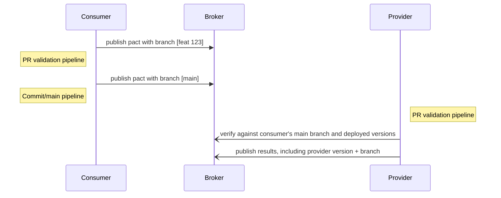

  
Gold diagram

The goal of this level is to add Pact support to your PR pipeline. This ensures that these builds fail if the contract or verification tests fail.

However, it does not prevent you from merging or deploying a change incompatible with the consumers or providers in a particular environment. That comes at the next level, when you add can-i-deploy support.

One of the complications introduced by the "consumer driven" nature of the workflow is that new interactions are usually added to the contract before the functionality has been implemented in the provider.

<!-- Using the workflow described above, a provider build will be kicked off when you publish a contract with new interactions. This build will \(correctly\) fail during the verification task. This is not ideal, as failure is expected. To solve this, we need to allow contracts to change without breaking the builds. -->

By using branches alongside application versions in the broker allows you to separate your "stable" pacts from your "feature pacts", and to introduce new expectations to a pact without breaking your provider builds. You can think of these as time ordered series of pacts that belong to each branch similar to git feature branches, where you can keep an unbreaking stable line of development while adding new, breaking interactions on the side.

  
Branches over time

To achieve this, when a pact is published, the associated pacticipant version should be published with a branch identifier that will be used by the provider to differentiate between the stable, safe pacts \(eg. branch "master"\) and the potentially breaking pacts \(eg. branch "feat-new-foobar"\).

To maintain a green build in your provider’s CI, we will use consumer version selectors to verify the main branch rather than the latest overall pact.

If you use feature branches for your consumer development, it is recommended to publish the pact with the participant version and the name of the branch. If you use feature toggles, the branch could be the name of the feature toggle. Your Pact client library will allow you to configure the name of the branch to be applied when you publish your pacts.

## Tasks

### A. Publish the pact from your consumer pull request pipeline

If you have done it correctly, the consumer contract tests should be part of your regular test run. But you still need to modify your pull request validation job to publish the pact, correctly identifying the consumer version and apply a branch with the pull request branch name

1. Configure your consumer build to run the Pact tests and publish its pact to the Broker as part of its CI build \(consult the documentation for your chosen language\). Consumer Pact tests typically run after the unit tests and before deploying to a test environment.
2. Configure a branch name to be used for every consumer build that publishes a pact (again, see your Pact language docs). The recommended default is to dynamically determine and use the name of your git/svn branch. If this doesn’t work for you, you could hardcode it to something like "main" or "stable".

### B. Modify the consumer commit pipeline to publish with the main branch

After you have set up the consumer pull request pipeline to publish pacts, you also need to modify your consumer's main
branch pipeline to indicate that a particular consumer version is now in the main branch. Usually, this would be performed by your CI system, which runs the same unit tests on the main branch after a pull request is merged.

The provider verification needs this information so it can get the latest pact that has been committed to the main
branch. If it gets the latest pact, it may get a pact committed on a feature branch and not ready for verification.

### C. Configure pact to be verified when the provider changes

Once the consumer publishes its pacts with the correct branch names from CI, you can add Pact verification to your provider pull request pipeline.

Pact verification by consumer version selectors should be part of your regular unit test run.

1. As per step 4, configure your provider build to fetch the pact(s) from the broker with consumer version selectors and publish the verification results as part of its main build \(consult the documentation for your chosen language\). This would typically happen after the unit tests and before deploying to a test environment. You can find the recommended configuration [here](/provider/recommended_configuration#verification-triggered-by-provider-change).
2. In the provider verification configuration, ensure the pact that is being verified from the latest pact for the main branch (see the relevant documentation for your library). This will help keep your provider builds green.
   1. `{ "mainBranch": true }` assuming our consumer was published from `main` / `master` - see [docs](https://docs.pact.io/pact_broker/branches#automatic-main-branch-detection) for setup in your pact-broker.

### Notes

Although some language-specific Pact tools \(eg Gradle\), provide methods for publishing, we recommend utilsing one of our [Pact CLI tools](https://docs.pact.io/pact_broker/client_cli)
  1. [Docker](https://hub.docker.com/r/pactfoundation/pact-cli)
  2. [Pact Standalone CLI](https://github.com/pact-foundation/pact-ruby-standalone/releases)
  3. [Pact Broker Client (Ruby)](https://github.com/pact-foundation/pact_broker-client)
  4. [Github Actions](https://github.com/pactflow/actions)

Useful link:

* [Best practices for pacticipant version numbers](getting_started/versioning_in_the_pact_broker.md)
* [Recommended configuration for publishing](https://docs.pact.io/consumer/recommended_configuration)
* [Recommended configuration for verifying](https://docs.pact.io/provider/recommended_configuration)
