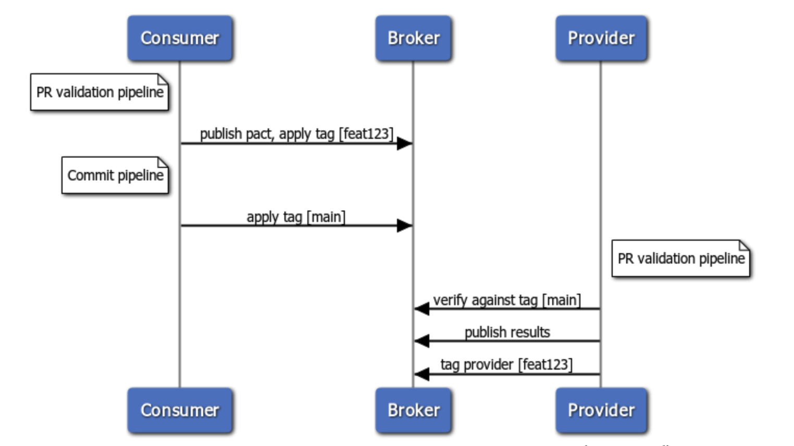

<details open>
  <summary>Gold diagram</summary>


</details>

The goal with this level is to add Pact support to your PR pipeline. This ensures that these builds will fail if the contract tests or verification tests fail.

However, it does not prevent you from merging or deploying a change that is incompatible with the consumers or provider in a particular environment. That comes at the next level, when you add can-i-deploy support.

One of the complications introduced by the "consumer driven" nature of the workflow is that new interactions are usually added to the contract before the functionality has been implemented in the provider. Using the workflow described above, a provider build will be kicked off when you publish a contract with new interactions in it. This build will \(correctly\) fail during the verification task. This is not ideal, as the failure is expected. To solve this, we need to allow contracts to change without breaking the builds.

"Tagging" application versions in the broker allows you to separate your "stable" pacts from your "feature pacts", and to introduce new expectations to a pact without breaking your provider builds. Tags are simple text labels that are applied to application versions, and you can think of the time ordered series of pacts that belong to each tag as forming a "pseudo branch". These pseudo branches can be used in a similar way to git feature branches, where you can keep an unbreaking stable line of development, while adding new, breaking interactions on the side.

<details open >
  <summary>Tags over time</summary>


</details>

To achieve these "pseudo branches", when a pact is published, the associated pacticipant version should be tagged with an identifier that will be used by the provider to differentiate between the stable, safe pacts \(eg. tagged "master"\) and the potentially breaking pacts \(eg. tagged "feat-new-foobar"\).

To keep a green build, in your provider’s CI verify the pact for the latest version tagged with the name of the stable tag, rather than verifying the latest overall pact.

If you use feature branches for your consumer development, it is recommended to tag the pacticipant version with the name of the branch. If you use feature toggles, the tag could be the name of the feature toggle. Your Pact client library will allow you to configure the name of the tag to be applied when you publish your pacts.

## Tasks

### A. Publish the pact from your consumer PR pipeline

If you have done it correctly, then the consumer contract tests should run as part of your regular test run. But you still need to modify your PR validation job to publish the pact, correctly identifying the consumer version and apply a tag with the PR branch name

1. Configure your consumer build to run the Pact tests and publish its pact to the Broker as part of its main build \(consult the documentation for your chosen language\). Consumer Pact tests typically run after the unit tests, and before deploying to a test environment.
2. Configure a branch name to be used for every consumer build that publishes a pact (again, see your Pact language docs). The recommended default is to dynamically determine and use the name of your git/svn branch. If this doesn’t work for you, then you could hardcode it to something like "master" or "stable". Your consumer and provider can be configured to use different name branches, it is just important to set the `mainBranch` property on each application (`pacticipant`) in the pact broker

### B. Modify the consumer commit pipeline to publish with main branch

After you have set up the consumer PR pipeline to publish pacts, you need to also modify your consumer's main
branch commit pipeline to indicate that a particular consumer version is now in the main branch.

### C. Add a step at the beginning of the pipeline to apply the name of your main branch (e.g. master, trunk or main)

The provider verification needs this information so it can get the latest pact that has been committed to the main
branch. If it gets the latest pact, it may get a pact that is committed on a feature branch and not ready for verification.

### **What it looks like***

We need a CI workflow

```js reference
https://github.com/YOU54F/path-to-pact-nirvana/blob/main/Step_06_PublishYourFirstPactFromCI/.github/workflows/build.yml
```

We run it via a script, that way we can move CI providers easily, Pact works in any CI/CD system

```js reference
https://github.com/YOU54F/path-to-pact-nirvana/blob/main/Step_06_PublishYourFirstPactFromCI/Makefile
```

### D. Configure pact to be verified when provider changes

Once the consumer is publishing its pacts and is associating them with the correct branch names, you can now add Pact verification to your provider PR pipeline.

Pact verification should run as part of your providers regular unit test run. We use consumer version selectors to determine which pacts to select

1. Configure a new provider build to fetch the pact(s) from the broker and publish the verification results as part of its main build \(consult the documentation for your chosen language\). This would typically happen after the unit tests, and before deploying to a test environment. You can find the recommended configuration [here](/provider/recommended_configuration#verification-triggered-by-provider-change).
2. In the provider verification configuration, setup the consumer version selectors, so the pact that is being verified is the latest for targeted branches and later environments. This will help keep your provider builds green.

### **What it looks like***

We need a workflow file for our provider, it looks very similar to our consumer ci, this workflow file will run every time the provider code changes

```js reference
https://github.com/YOU54F/path-to-pact-nirvana/blob/main/Step_07_VerifyYourFirstPactFromCI/.github/workflows/build.yml
```

We run it via a script, that way we can move CI providers easily, Pact works in any CI/CD system.

You will note there are two tasks, `test_contract_requiring_verification` & `test_provider_change`

```js reference
https://github.com/YOU54F/path-to-pact-nirvana/blob/main/Step_07_VerifyYourFirstPactFromCI/Makefile
```

Lets update our original provider verification task to read from our Pact broker, this is our `test_contract_requiring_verification`, we wont run this now, it will be triggered later.

```js reference
https://github.com/YOU54F/path-to-pact-nirvana/blob/main/Step_07_VerifyYourFirstPactFromCI/provider/provider.consumerChange.spec.js
```

We are going to create a new provider CI task, this is designed to protect our provider, when they change

```js reference
https://github.com/YOU54F/path-to-pact-nirvana/blob/main/Step_07_VerifyYourFirstPactFromCI/provider/provider.providerChange.spec.js
```

Lets update our setup file, so we only run the specified test files

```js reference
https://github.com/YOU54F/path-to-pact-nirvana/blob/main/Step_07_VerifyYourFirstPactFromCI/package.json
```

### Notes

In addition to some of the language-specific Pact tools \(eg Gradle\), tagging can be done with the [Pact Broker CLI](https://github.com/pact-foundation/pact_broker-client#create-version-tag).

Useful link:

* [Best practices for pacticipant version numbers](getting_started/versioning_in_the_pact_broker.md)
