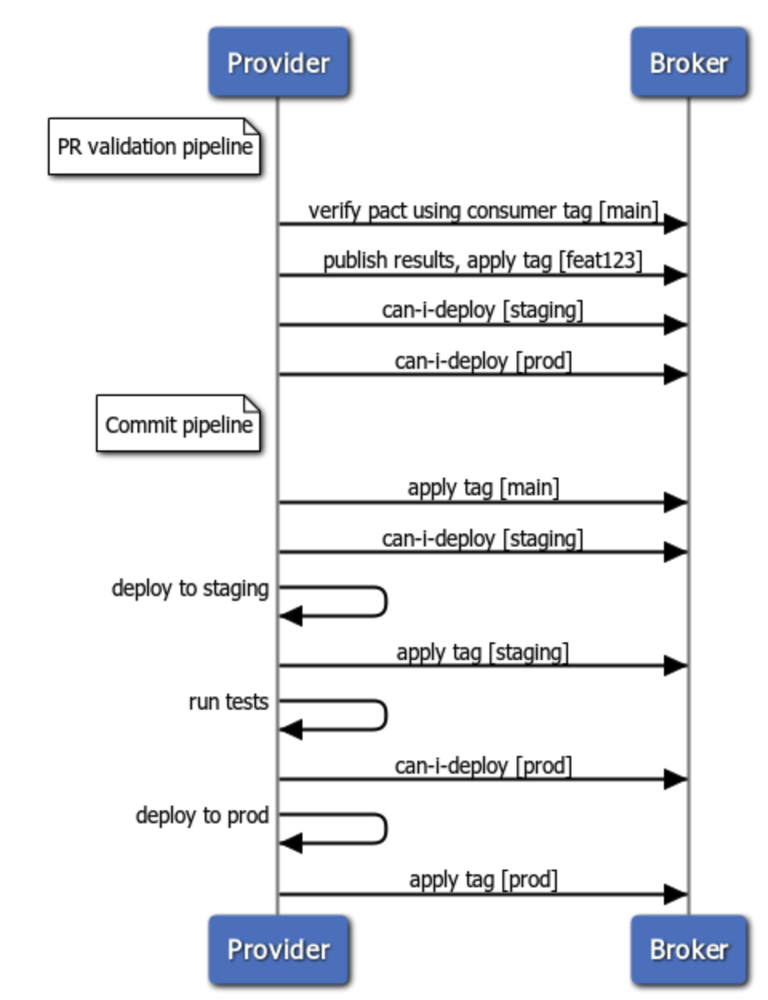

It's all very well knowing that your consumer/provider are compatible with the head versions of each other, but if you want to be able to deploy your consumer and provider independently, you also need to be sure that the latest version of the provider is compatible with the production version of the consumer. The ability to do this is a major selling point of Pact.

Environments allow you to ensure backwards compatibility between production and head versions of your applications by allowing the provider to verify the pact associated with the latest production version as well as the latest master version. This enables the safe deployment workflow described in step 6.

Before you deploy to a production environment, you need to know whether or not your app is compatible with the versions of the other apps that already exist in that environment. The old-fashioned way of managing these dependencies involved deploying sets of pre-tested applications together, creating a bottleneck and meaning that speedy development and testing on one application may be negated by slow development and testing on another.

## Let's record our deployments

Now we're ready to tell the pact-broker when we deploy a version of our application, and switch `can-i-deploy` to use environment names rather than branch names.

  
Diamond level diagram

Note how in the PR pipeline we are checking to see if we can deploy to all the environments that we deploy to from 
the main branch. The rationale for this is that we don't want to merge something into our main branch which we know 
will break once we deploy - we want our main branch to stay clean and not get blocked by broken builds.  If you 
deploy to other environments such as preprod, you would want to check that environment as well.

Then, when we're actually ready to deploy to an environment, we check again. We do this because the version of the 
other side of the contract could have changed since the PR validation ran.  Doing the check in the PR pipeline 
reduces the chance of breakage, but it's still a possibility, and we want to check for that before we deploy.

Note also that the first step in our commit pipeline is to let the broker know that a particular version of the 
provider or consumer is now in the main branch.

### Add `record-deployment` to your commit pipelines

The first step is to start recording deployments with the pact-cli tooling when the consumer or provider is deployed to an environment. So when you successfully deploy to staging, record the deployment of that application version to production; when you successfully deploy to prod, record the production tag. Do this for each environment you deploy to. 

__Note:__ You may have multiple versions of an application live, if so, use `record-release`. This is similar but won't undeploy the other versions of the application in a specified environment

1. Add a step to your deployment process so that when the consumer is deployed to an environment, the relevant pacticipant version in the broker is recorded with the name of the environment (eg. `test`, `production`). This functionality is provided by the [pact broker CLI](/pact_broker/client_cli/readm#record-deployment) which is available as a standalone executable, and a Docker image. Alternatively you can use the API for creating environments and recording releases or deployements, with documentation [here](https://docs.pact.io/pact_broker/recording_deployments_and_releases#environments).
2. Use the `deployedOrReleased` selector to the list of pacts the provider will verify (eg. `{ consumerVersionSelectors: { deployedOrReleased: "true" }, { mainBranch: "true"} }`), see the consumer version selectors documentation page [here](https://docs.pact.io/pact_broker/advanced_topics/consumer_version_selectors)
3. Make sure that you use the same agreed upon names for each environment for all subsequent applications. (eg. is it `prod` or is it `production`?) Having a mix of environment names will not allow you to successfully use the `can-i-deploy` tool to ensure safe deployments.

### Add can-i-deploy to your commit pipelines

Once you have successfully run your pipeline with the tagging, you can safely add `can-i-deploy` checks before you 
deploy to an environment, to make sure it's safe to deploy.

### Add can-i-deploy to environments to your PR pipelines

The final step is to make sure before you merge a PR that you can successfully deploy to all the environments that are 
targeted from the main branch (staging, prod, preprod, etc.)

### What if we use a release branch?

If you use a release branch, then you do not deploy to prod and preprod from your main branch, so you can eliminate 
that check on the PR pipeline.

However, before you cut a release branch, you want to check if you can deploy to preprod and prod.

The general idea is:

- check if you can deploy to an environment before you commit a change to the branch it is deployed from
- check again if you can deploy to an environment just before you actually deploy to that environment.

It might look something like this:

  
Diamond with release branch diagram

### Modify can-i-deploy in your consumer and provider PR validation pipelines

Now that you are recorded your provider with the environment it is deployed to, you can modify your PR pipeline to 
ask if you can deploy to the agreed environment, rather than to the main branch.

Congratulations! You have fully operationalized Pact!

Useful links:

* [Checking verification results using the can-i-deploy CLI](/pact_broker/can_i_deploy/)
* [can-i-deploy CLI documentation](/pact_broker/client_cli/readme#can-i-deploy)
* [consumer version selectors](https://docs.pact.io/pact_broker/advanced_topics/consumer_version_selectors)