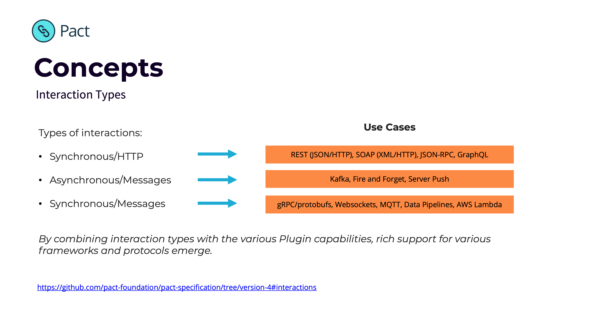

## Introduction to Plugins

**Goals**

The Pact Plugin Framework was created in order to:

* Expand support to the widest range of use cases
* Improve time-to-market for new features
* Grow our community (users + contributors)

The framework allows users to extend Pact by creating new types of:

* Transports (e.g. gRPC, Websockets)
* Protocols (e.g. protobufs, GraphQL)

**Interaction types**

Pact has three types of interactions:

1. Synchronous/HTTP - models standard HTTP interactions
2. Asynchronous/Messages - models unidirectional events/messages
3. Synchronous/Messages - models bi-directional or streaming events/messages

The combination of these interaction types with new transports and protocols, enables you to model almost any type of API and support any use case.

## Conceptual Overview

Diving a bit deeper, let's look at the various system actors and how they work together with Plugins.

1. Your code 😉
2. The test framework executing tests e.g. Jest, JUnit
3. The Pact Client library used in the test e.g. Pact JS, Pact JVM
4. The Shared Core (Rust) or the Java Plugin Driver (for JVM projects) manages the lifecycle of a Pact test and provides key capabilities to client libraries. It oversees the use of plugins via the Plugin Driver

5. Plugin driver is responsible for discovering, starting and orchestrating plugins.
6. Plugin may communicate to/from the SUT e.g. in the case of a new transport it will serve as the mock server, and will also issue verification requests at the Provider API
7. The pact file contains additional information
   * Required plugins
   * Transports
   * Interaction type
   * Markdown to display interactions