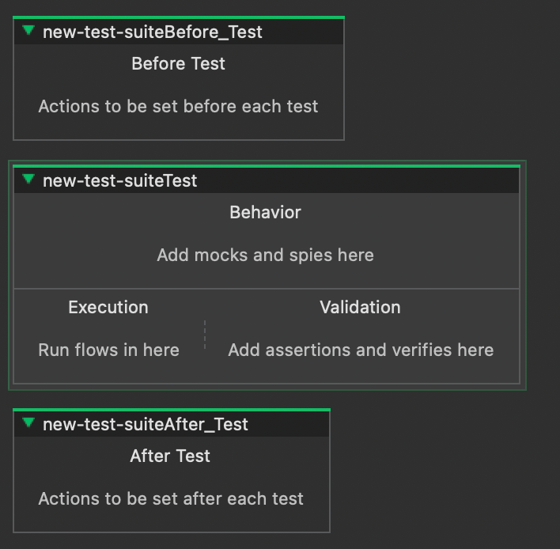
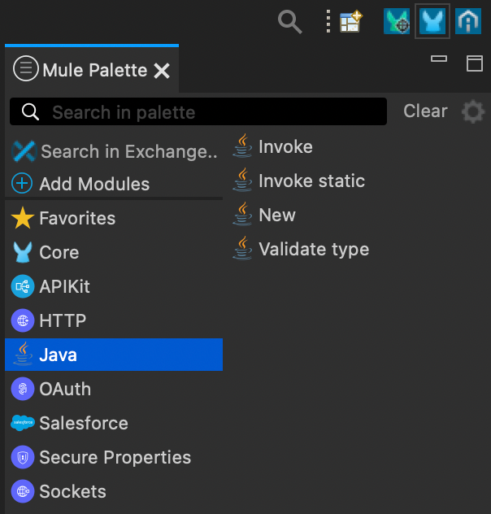
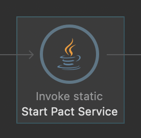
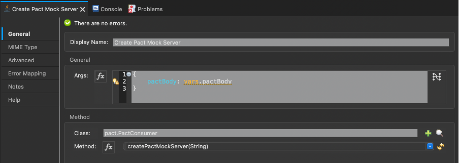

## Problem Statement

As of Mule 4, it is no longer possible to extend the MUnit runner through Java code. Previously, the solution of Pact testing with MuleSoft was to extend “FunctionalMunitSuite” in your test class. An example can be found here: https://docs.mulesoft.com/munit/1.3/munit-tests-with-Java#creating-your-suite-class

However, MuleSoft now wants alignment with the Mule language to be able to provide a better service. This leaves the outstanding problem: how can Pact be used to test Mule 4 applications?

In a nutshell, the solution is to have MUnit be the test runner and execute the standalone Pact-JVM server by calling Java code within the MUnit console. This provides the benefit of MUnit tests along with pact files being created for contract testing — leveraging MUnit unit test coverage while also generating pact files and publishing them to a Pact Broker or sharing them to your own file storage system.

## Consumer

### How it works

The first step is to understand the MUnit test layout. It has a very similar test structure to other unit testing tools, such as Jest, jUnit, nUnit, etc., with the usual before suite, before test, after test, and after suite. The test logic is formed into the test blocks where “flows” are executed in the test scripts.

An empty MUnit test would look like the following:



The test block is divided into three sections: execution, behavior, and validation. Assertions come from MUnit tools providing a low-code UI block configured for each type of unit test assertion on the flow.

Looking through the Mule Palette, in addition to these low code blocks there are also Java blocks for writing Java classes with the ability to call functions. 

The functionality of these blocks is as follows:

- New: creates a new class
- Invoke static: invoke static methods
- Invoke: invoke methods on an instantiated class
- Validate type: check instance is of a given class



This recipe uses all but the ‘Validate type’ Java block — you are welcome to include it in your own solution.

### Starting the Pact JVM from Java

To use the standalone JVM of Pact, create a static class called `PactService`. This handles the commands to run and close the Pact Standalone Server. The class needs the following functions:

- `startPactService()`: will start the service through the CLI command
- `stopPactService()`: will stop the Java process

```java
public static Process startPactService() throws IOException, InterruptedException {
  String command = "pact-jvm-server "
		+ pactServicePort
		+ " -l "
		+ mockPactServerPort
		+ " -u "
		+ mockPactServerPort
		+ " --broker "
		+ brokerUrl
		+ " -v 3";

	Process pactService = Runtime.getRuntime().exec(command);

	return pactService;
}

public static void stopPactService() throws ClientProtocolException, IOException {
	pactService.destroy();
}
```

Setting the service to a variable allows you to stop the running process later with the `.destroy()` command.

More information on the Pact JVM can be found here: https://docs.pact.io/implementation_guides/jvm/pact-jvm-server

#### From Anypoint Studio

From Anypoint Studio, use the "Invoke Static" Java block to call the `startPactService()` method within the PactService class.

This will start running the Pact standalone server as a separate Java process on the machine.



### Creating a Mock Service

With the service running, make API calls to localhost on the configured port. Use the Java "Invoke static" Mule widget for this, as only API calls to localhost are needed to set up the Mock API Provider.

Here is an example of using a CloseableHttpClient but you can use any preferred method for making the API calls from Java.

```java
public static void createPactMockServer(String pactBody) throws ClientProtocolException, IOException, InterruptedException {
  CloseableHttpClient client = HttpClients.createDefault();
  HttpPost post = new HttpPost("http://localhost:" + pactServicePort + "/create?state=NoUsers&path=/sub/ref/path");
  ResponseHandler<String> handler = new BasicResponseHandler();

  post.setHeader("Content-Type", "application/json");
  post.setEntity(new StringEntity(pactBody));

  client.execute(post, handler);

  close();
}
```

The variable pactServicePort is the port that the Pact service is running on. The pactBody can be passed from another Java function that can use the `ConsumerPactBuilder` to set up the pact interactions that would be required to be sent. 

This would be very similar to the example logic provided here: https://docs.pact.io/implementation_guides/jvm/consumer

When setting up the `pactBody` variable, use the "New" and "Invoke" Mule Java blocks to avoid errors. Other solutions using static methods may also work.

#### From Anypoint Studio

An example setup from Anypoint Studio would be like the below image passing a variable from another Java class.



#### Hooking up to MUnit test

Finally, to connect to the service, all you need to do is set the API URL to localhost. This can be done through environment variables or other techniques that you would use for writing MUnit tests normally.

## Provider

Running provider tests is incredibly simpler than the Consumer side of the contract. You can simply use the Pact Maven plugin found in the Pact docs here: https://docs.pact.io/implementation_guides/jvm/provider/maven

To run the provider tests you will need to use the command: `mvn pact:verify`

## Mule 3 and Lower Solution:

Using Mule 3 or lower? Check out this example repo by Michael Hyatt: https://github.com/michaelhyatt/mule-pact
