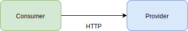
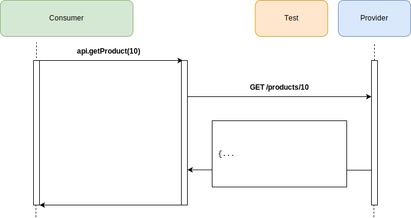
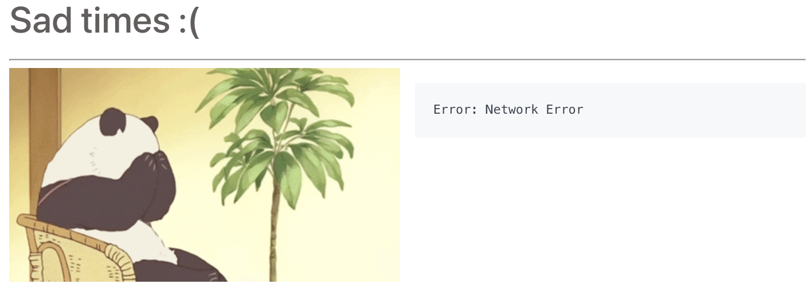

import Tabs from '@theme/Tabs';
import TabItem from '@theme/TabItem';

:::info
**Move to step 1**

_`git checkout step1`_

<Tabs
groupId="sdk-choice"
defaultValue="javascript"
values={[
{label: 'Javascript', value: 'javascript', },
]}>
<TabItem value="javascript">

_`npm install`_

</TabItem>
<TabItem value="java">
</TabItem>
<TabItem value="java">
</TabItem>
<TabItem value="gradle">
</TabItem>
<TabItem value="ruby">
</TabItem>
<TabItem value="python">
</TabItem>
<TabItem value="C#">
</TabItem>
<TabItem value="golang">
</TabItem>
</Tabs>

:::

## Learning Objectives

| Step                                                                 | Title                                                   | Concept Covered                          | Learning objectives                                                                                                                                                                                              | Further Reading                                                                                                                                           |
|----------------------------------------------------------------------|---------------------------------------------------------|------------------------------------------|------------------------------------------------------------------------------------------------------------------------------------------------------------------------------------------------------------------|-----------------------------------------------------------------------------------------------------------------------------------------------------------|
| [step 1](https://github.com/pact-foundation/pact-workshop-js/tree/step1)   | Create our consumer before the Provider API even exists | Consumer-driven design                   | <ul><li>Understand use case</li></ul>                                                                                                                                                                             | <ul><li>https://martinfowler.com/articles/consumerDrivenContracts.html</li></ul>|
<hr/>

We need to first create an HTTP client to make the calls to our provider service:



The Consumer has implemented the product service client which has the following:

- `GET /products` - Retrieve all products
- `GET /products/{id}` - Retrieve a single product by ID

The diagram below highlights the interaction for retrieving a product with ID 10:



You can see the client interface we created

<!-- TODO: Sync code from each repo to render code blocks -->
<!-- <Tabs
groupId="sdk-choice"
defaultValue="javascript"
values={[
{label: 'Javascript', value: 'javascript', },
{label: 'Java', value: 'java', },
{label: 'Gradle', value: 'gradle', },
{label: 'Ruby', value: 'ruby', },
{label: 'C#', value: 'c#', },
{label: 'Golang', value: 'golang', }
]}> -->

<Tabs
groupId="sdk-choice"
defaultValue="javascript"
values={[
{label: 'Javascript', value: 'javascript', },
]}>
<TabItem value="javascript">

in `consumer/src/api.js`:

```javascript
export class API {

    constructor(url) {
        if (url === undefined || url === "") {
            url = process.env.REACT_APP_API_BASE_URL;
        }
        if (url.endsWith("/")) {
            url = url.substr(0, url.length - 1)
        }
        this.url = url
    }

    withPath(path) {
        if (!path.startsWith("/")) {
            path = "/" + path
        }
        return `${this.url}${path}`
    }

    async getAllProducts() {
        return axios.get(this.withPath("/products"))
            .then(r => r.data);
    }

    async getProduct(id) {
        return axios.get(this.withPath("/products/" + id))
            .then(r => r.data);
    }
}
```

</TabItem>

<TabItem value="java">

in `consumer/src/main/java/io/pact/workshop/product_catalogue/clients/ProductServiceClient.java`:

```java
@Service
public class ProductServiceClient {
  @Autowired
  private RestTemplate restTemplate;

  @Value("${serviceClients.products.baseUrl}")
  private String baseUrl;

  public ProductServiceResponse fetchProducts() {
    return restTemplate.getForObject(baseUrl + "/products", ProductServiceResponse.class);
  }

  public Product fetchProductById(long id) {
    return restTemplate.getForObject(baseUrl + "/products/" + id, Product.class);
  }
}
```

</TabItem>
<TabItem value="gradle">

in `consumer/src/main/au/com/dius/pactworkshop/consumer/ProductService.java`:

```java
@Service
public class ProductService {

    private final RestTemplate restTemplate;

    @Autowired
    public ProductService(RestTemplate restTemplate) {
        this.restTemplate = restTemplate;
    }

    public List<Product> getAllProducts() {
        return restTemplate.exchange("/products",
                HttpMethod.GET,
                null,
                new ParameterizedTypeReference<List<Product>>(){}).getBody();
    }

    public Product getProduct(String id) {
        return restTemplate.getForEntity("/products/{id}", Product.class, id).getBody();
    }
}
```

</TabItem>
<TabItem value="ruby">

in `client.rb`:

```ruby
    require 'httparty'
    require 'uri'
    require 'json'

    class Client


      def load_provider_json
        response = HTTParty.get(URI::encode('http://localhost:8081/provider.json?valid_date=' + Time.now.httpdate))
        if response.success?
          JSON.parse(response.body)
        end
      end


    end
```

</TabItem>

<TabItem value="c#">

in `Consumer/src/ApiClient.cs`:

```csharp
using System;
using System.Net.Http;
using System.Threading.Tasks;

namespace Consumer
{
    public class ApiClient
    {
        private readonly Uri BaseUri;

        public ApiClient(Uri baseUri)
        {
            this.BaseUri = baseUri;
        }

        public async Task<HttpResponseMessage> GetAllProducts()
        {
            using (var client = new HttpClient { BaseAddress = BaseUri })
            {
                try
                {
                    var response = await client.GetAsync($"/api/products");
                    return response;
                }
                catch (Exception ex)
                {
                    throw new Exception("There was a problem connecting to Products API.", ex);
                }
            }
        }

        public async Task<HttpResponseMessage> GetProduct(int id)
        {
            using (var client = new HttpClient { BaseAddress = BaseUri })
            {
                try
                {
                    var response = await client.GetAsync($"/api/product/{id}");
                    return response;
                }
                catch (Exception ex)
                {
                    throw new Exception("There was a problem connecting to Products API.", ex);
                }
            }
        }
    }
}
```

</TabItem>
<TabItem value="golang">

in the `consumer/client` package:

```go
type Client struct {
	BaseURL    *url.URL
	httpClient *http.Client
}

// GetUser gets a single user from the API
func (c *Client) GetUser(id int) (*model.User, error) {
}
```

</TabItem>
</Tabs>


After forking or cloning the repository, we may want to install the dependencies `npm install`.
We can run the client with `npm start --prefix consumer` - it should fail with the error below, because the Provider is not running.



*Move on to [step 2](https://github.com/pact-foundation/pact-workshop-js/tree/step2#step-2---client-tested-but-integration-fails)*

