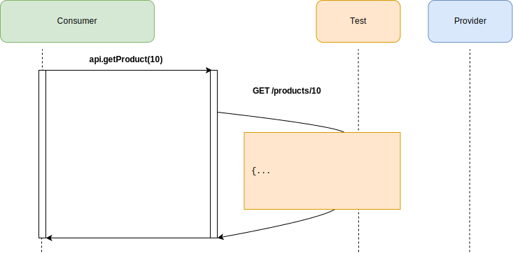
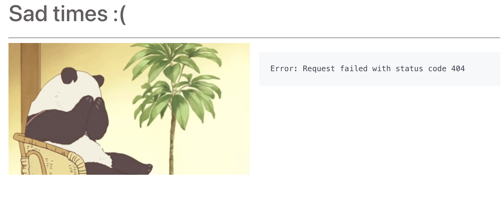

import Tabs from '@theme/Tabs';
import TabItem from '@theme/TabItem';

:::info
**Move to step 2**

_`git checkout step2`_

<Tabs
groupId="sdk-choice"
defaultValue="javascript"
values={[
{label: 'Javascript', value: 'javascript', },
]}>
<TabItem value="javascript">

_`npm install`_

</TabItem>
<TabItem value="java">
</TabItem>
<TabItem value="java">
</TabItem>
<TabItem value="gradle">
</TabItem>
<TabItem value="ruby">
</TabItem>
<TabItem value="python">
</TabItem>
<TabItem value="C#">
</TabItem>
<TabItem value="golang">
</TabItem>
</Tabs>

:::

Now lets create a basic test for our API client. We're going to check 2 things:

1. That our client code hits the expected endpoint
2. That the response is marshalled into an object that is usable, with the correct ID

You can see the client interface test we created:

<Tabs
groupId="sdk-choice"
defaultValue="javascript"
values={[
{label: 'Javascript', value: 'javascript', },
]}>
<TabItem value="javascript">

in `consumer/src/api.spec.js`:

```javascript
import API from "./api";
import nock from "nock";

describe("API", () => {

    test("get all products", async () => {
        const products = [
            {
                "id": "9",
                "type": "CREDIT_CARD",
                "name": "GEM Visa",
                "version": "v2"
            },
            {
                "id": "10",
                "type": "CREDIT_CARD",
                "name": "28 Degrees",
                "version": "v1"
            }
        ];
        nock(API.url)
            .get('/products')
            .reply(200,
                products,
                {'Access-Control-Allow-Origin': '*'});
        const respProducts = await API.getAllProducts();
        expect(respProducts).toEqual(products);
    });

    test("get product ID 50", async () => {
        const product = {
            "id": "50",
            "type": "CREDIT_CARD",
            "name": "28 Degrees",
            "version": "v1"
        };
        nock(API.url)
            .get('/products/50')
            .reply(200, product, {'Access-Control-Allow-Origin': '*'});
        const respProduct = await API.getProduct("50");
        expect(respProduct).toEqual(product);
    });
});
```

</TabItem>
<TabItem value="java">

in `consumer/src/test/java/io/pact/workshop/product_catalogue/clients/ProductServiceClientTest.java`:

```java
  @Test
  void getProductById(@Wiremock WireMockServer server, @WiremockUri String uri) {
      productServiceClient.setBaseUrl(uri);
      server.stubFor(
          get(urlPathEqualTo("/products/10"))
              .willReturn(aResponse()
              .withStatus(200)
              .withBody("{\n" +
                  "            \"id\": 50,\n" +
                  "            \"type\": \"CREDIT_CARD\",\n" +
                  "            \"name\": \"28 Degrees\",\n" +
                  "            \"version\": \"v1\"\n" +
                  "        }\n")
              .withHeader("Content-Type", "application/json"))
      );
    
      Product product = productServiceClient.getProductById(10);
      assertThat(product, is(equalTo(new Product(10L, "28 Degrees", "CREDIT_CARD", "v1"))));
  }
```

</TabItem>
<TabItem value="gradle">

in `consumer/src/test/java/au/com/dius/pactworkshop/consumer/ProductServiceTest.java`:

```java
class ProductServiceTest {

  private WireMockServer wireMockServer;
  private ProductService productService;

  @BeforeEach
  void setUp() {
    wireMockServer = new WireMockServer(options().dynamicPort());

    wireMockServer.start();

    RestTemplate restTemplate = new RestTemplateBuilder()
      .rootUri(wireMockServer.baseUrl())
      .build();

    productService = new ProductService(restTemplate);
  }

  @AfterEach
  void tearDown() {
    wireMockServer.stop();
  }

  @Test
  void getAllProducts() {
    wireMockServer.stubFor(get(urlPathEqualTo("/products"))
      .willReturn(aResponse()
        .withStatus(200)
        .withHeader("Content-Type", "application/json")
        .withBody("[" +
          "{\"id\":\"9\",\"type\":\"CREDIT_CARD\",\"name\":\"GEM Visa\",\"version\":\"v2\"},"+
          "{\"id\":\"10\",\"type\":\"CREDIT_CARD\",\"name\":\"28 Degrees\",\"version\":\"v1\"}"+
          "]")));

    List<Product> expected = Arrays.asList(new Product("9", "CREDIT_CARD", "GEM Visa", "v2"),
      new Product("10", "CREDIT_CARD", "28 Degrees", "v1"));

    List<Product> products = productService.getAllProducts();

    assertEquals(expected, products);
  }

  @Test
  void getProductById() {
    wireMockServer.stubFor(get(urlPathEqualTo("/products/50"))
      .willReturn(aResponse()
        .withStatus(200)
        .withHeader("Content-Type", "application/json")
        .withBody("{\"id\":\"50\",\"type\":\"CREDIT_CARD\",\"name\":\"28 Degrees\",\"version\":\"v1\"}")));

    Product expected = new Product("50", "CREDIT_CARD", "28 Degrees", "v1");

    Product product = productService.getProduct("50");

    assertEquals(expected, product);
  }
}
```

</TabItem>
<TabItem value="ruby">

in `client_spec.rb`

```ruby
    require 'spec_helper'
    require 'client'


    describe Client do


      let(:json_data) do
        {
          "test" => "NO",
          "date" => "2013-08-16T15:31:20+10:00",
          "count" => 100
        }
      end
      let(:response) { double('Response', :success? => true, :body => json_data.to_json) }


      it 'can process the json payload from the provider' do
        HTTParty.stub(:get).and_return(response)
        expect(subject.process_data).to eql([1, Time.parse(json_data['date'])])
      end

    end
```

</TabItem>
<TabItem value="c#">

not implemented

</TabItem>
<TabItem value="golang">

in `consumer/client/client_test.go`

```go
func TestClientUnit_GetUser(t *testing.T) {
	userID := 10

	// Setup mock server
	server := httptest.NewServer(http.HandlerFunc(func(rw http.ResponseWriter, req *http.Request) {
		assert.Equal(t, req.URL.String(), fmt.Sprintf("/user/%d", userID))
		user, _ := json.Marshal(model.User{
			FirstName: "Sally",
			LastName:  "McDougall",
			ID:        userID,
			Type:      "admin",
			Username:  "smcdougall",
		})
		rw.Write([]byte(user))
	}))
	defer server.Close()

	// Setup client
	u, _ := url.Parse(server.URL)
	client := &Client{
		BaseURL: u,
	}
	user, err := client.GetUser(userID)
	assert.NoError(t, err)

	// Assert basic fact
	assert.Equal(t, user.ID, userID)
}

```

</TabItem>
</Tabs>




Let's run this test and see it all pass:

```console
❯ npm test --prefix consumer

PASS src/api.spec.js
  API
    ✓ get all products (15ms)
    ✓ get product ID 50 (3ms)

Test Suites: 1 passed, 1 total
Tests:       2 passed, 2 total
Snapshots:   0 total
Time:        1.03s
Ran all test suites.
```

If you encounter failing tests after running `npm test --prefix consumer`, make sure that the current branch is `step2`.

Meanwhile, our provider team has started building out their API in parallel. Let's run our website against our provider (you'll need two terminals to do this):


```console
# Terminal 1
❯ npm start --prefix provider

Provider API listening on port 8080...
```

```console
# Terminal 2
> npm start --prefix consumer

Compiled successfully!

You can now view pact-workshop-js in the browser.

  Local:            http://127.0.0.1:3000/
  On Your Network:  http://192.168.20.17:3000/

Note that the development build is not optimized.
To create a production build, use npm run build.
```

You should now see a screen showing 3 different products. There is a `See more!` button which should display detailed product information.

Let's see what happens!



Doh! We are getting 404 everytime we try to view detailed product information. On closer inspection, the provider only knows about `/product/{id}` and `/products`.

We need to have a conversation about what the endpoint should be, but first...

*Move on to [step 3](https://github.com/pact-foundation/pact-workshop-js/tree/step3#step-3---pact-to-the-rescue)*

