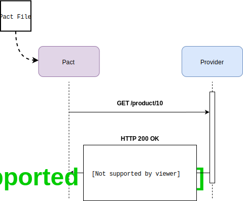

import Tabs from '@theme/Tabs';
import TabItem from '@theme/TabItem';

:::info
**Move to step 5**

_`git checkout step5`_

<Tabs
groupId="sdk-choice"
defaultValue="javascript"
values={[
{label: 'Javascript', value: 'javascript', },
]}>
<TabItem value="javascript">

_`npm install`_

</TabItem>
<TabItem value="java">
</TabItem>
<TabItem value="java">
</TabItem>
<TabItem value="gradle">
</TabItem>
<TabItem value="ruby">
</TabItem>
<TabItem value="python">
</TabItem>
<TabItem value="C#">
</TabItem>
<TabItem value="golang">
</TabItem>
</Tabs>

:::

We now need to update the consumer client and tests to hit the correct product path.

First, we need to update the GET route for the client:

In `consumer/src/api.js`:

<Tabs
groupId="sdk-choice"
defaultValue="javascript"
values={[
{label: 'Javascript', value: 'javascript', },
]}>
<TabItem value="javascript">

```javascript
async getProduct(id) {
  return axios.get(this.withPath("/product/" + id))
  .then(r => r.data);
}
```

Then we need to update the Pact test `ID 10 exists` to use the correct endpoint in `path`.

In `consumer/src/api.pact.spec.js`:

```javascript
describe("getting one product", () => {
  test("ID 10 exists", async () => {

    // set up Pact interactions
    await provider.addInteraction({
      state: 'product with ID 10 exists',
      uponReceiving: 'get product with ID 10',
      withRequest: {
        method: 'GET',
        path: '/product/10'
      },

...
```

</TabItem>
<TabItem value="java">
</TabItem>
<TabItem value="gradle">
</TabItem>
<TabItem value="ruby">
</TabItem>
<TabItem value="c#">
</TabItem>
<TabItem value="golang">
</TabItem>
</Tabs>



Let's run and generate an updated pact file on the client:

```console
❯ npm run test:pact --prefix consumer

PASS src/api.pact.spec.js
  API Pact test
    getting all products
      ✓ products exists (18ms)
    getting one product
      ✓ ID 10 exists (8ms)

Test Suites: 1 passed, 1 total
Tests:       2 passed, 2 total
Snapshots:   0 total
Time:        2.106s
Ran all test suites matching /pact.spec.js/i.
```

Now we run the provider tests again with the updated contract:

Run the command:

```console
❯ npm run test:pact --prefix provider

Verifying a pact between FrontendWebsite and ProductService

  get product with ID 10
    returns a response which
      has status code 200 (OK)
      includes headers
        "Content-Type" with value "application/json; charset=utf-8" (OK)
      has a matching body (OK)

  get all products
    returns a response which
      has status code 200 (OK)
      includes headers
        "Content-Type" with value "application/json; charset=utf-8" (OK)
      has a matching body (OK)
```

Yay - green ✅!

Move on to [step 6](https://github.com/pact-foundation/pact-workshop-js/tree/step6#step-6---consumer-updates-contract-for-missing-products)
