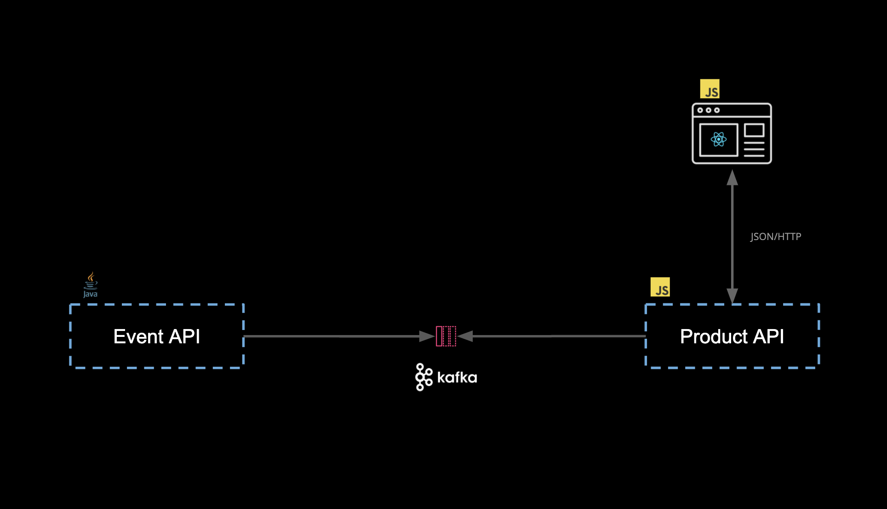

There are two components in scope for our workshop.

1. Product Catalog API (Consumer/Subscriber). a simple HTTP service that exposes product information as a REST API, which is fed events from an Event API on the `product` topic.
2. Product Event (Provider). A service that publishes product events to a Kafka stream on the `product` topic.

We will only be focusing on the messages sent via Kafka and not the HTTP service, you can follow the [HTTP workshop](/university/introduction/00_1_Intro), to see Pact in action against the HTTP endpoints.

