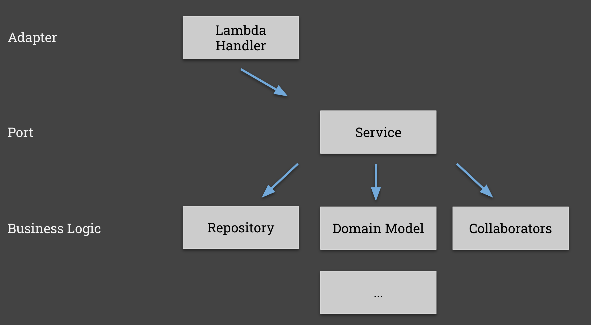

import Tabs from '@theme/Tabs';
import TabItem from '@theme/TabItem';

## Learning Objectives

| Step                                                                                                             | Title                                                   | Concept Covered                                    | Learning objectives                   | Further Reading                                                                  |
| ---------------------------------------------------------------------------------------------------------------- | ------------------------------------------------------- | -------------------------------------------------- | ------------------------------------- | -------------------------------------------------------------------------------- |
| [step 1](https://github.com/pact-foundation/pact-workshop-message?tab=readme-ov-file#step-1---create-consumer-subscriber) | Create our consumer before the Provider API even exists | Consumer-driven design with Hexagonal Architecture | <ul><li>Understand use case</li></ul> | <ul><li>https://martinfowler.com/articles/consumerDrivenContracts.html</li></ul> |

<hr/>

## Hexagonal Architecture

We recommend that you split the code that is responsible for handling the protocol specific things - for example an AWS lambda handler and the AWS SNS input body - and the piece of code that actually handles the payload.

You're may be familiar with layered architectures such as Ports and Adapters (also referred to as a Hexagonal architecture) - If not, we recommend reading [Alistair Cockburn's guide](https://alistair.cockburn.us/hexagonal-architecture/). 

Following a modular architecture will allow you to do this much more easily:



## Our Scenario

Let's walk through an example using a `product event` published through a message broker, in our instance Kafka as an example.

The consumer expects to receive a message of the following shape:

```json
{
  "id": "some-uuid-1234-5678",
  "type": "spare",
  "name": "3mm hex bolt",
  "version": "v1",
  "event": "UPDATED"
}
```

## Adapter

With this view, the "Adapter" will be the code that deals with the specific queue implementation. For example, it might be the lambda `handler` that receives the SNS message that wraps this payload, or the function that can read the message from a Kafka queue (wrapped in a Kafka specific container). Here is the kafka version:

<Tabs
groupId="sdk-choice"
defaultValue="javascript"
values={[
{label: 'Javascript', value: 'javascript', },
{label: 'Java', value: 'java', },
{label: 'Python', value: 'python', },
{label: 'C#', value: 'c#', },
{label: 'Golang', value: 'golang', },
{label: 'Rust', value: 'rust', },
]}>

<TabItem value="javascript">

in `consumer-js-kafka/src/service/kafka.js`:

```javascript
const consumeProductStream = async (handler) => {
  await consumer.connect();
  await consumer.subscribe({ topic: "products", fromBeginning: false });
  await consumer.run({
    eachMessage: async ({ topic, partition, message }) => {
      console.log("received message");
      try {
        await handler(JSON.parse(message.value.toString()));
      } catch (e) {
        console.error("unable to handle incoming message", e);
      }
    },
  });
};
```

</TabItem>

<TabItem value="java">

in `consumer-java-kafka/src/main/java/io/pactflow/example/kafka/KafkaConfiguration.java`:

```java
@EnableKafka
@Configuration
public class KafkaConfiguration {

  @Bean
  public ConsumerFactory<String, Product> productConsumerFactory() {
    Map<String, Object> props = new HashMap<>();
    props.put(ConsumerConfig.BOOTSTRAP_SERVERS_CONFIG, "localhost:9092");
    props.put(ConsumerConfig.GROUP_ID_CONFIG, "products_group");
    props.put(ConsumerConfig.KEY_DESERIALIZER_CLASS_CONFIG, StringDeserializer.class);
    props.put(ConsumerConfig.VALUE_DESERIALIZER_CLASS_CONFIG, JsonSerializer.class);
    return new DefaultKafkaConsumerFactory<>(props, new StringDeserializer(), new JsonDeserializer<>(Product.class));
  }

  @Bean
  public ConcurrentKafkaListenerContainerFactory<String, Product> kafkaListenerContainerFactory() {

    ConcurrentKafkaListenerContainerFactory<String, Product> factory = new ConcurrentKafkaListenerContainerFactory<>();
    factory.setConsumerFactory(productConsumerFactory());

    return factory;
  }
}
```

</TabItem>

<TabItem value="c#">

in `consumer-dotnet-kafka/src/KafkaConsumer.cs`:

```csharp
consumer.Subscribe(_topic);
var processor = new ProductEventProcessor();
try
{
    while (true)
    {
        var cr = consumer.Consume(cts.Token);
        Console.WriteLine($"Consumed event from topic {_topic}: key = {cr.Message.Key,-10} value = {cr.Message.Value}");
        var productEvent = System.Text.Json.JsonSerializer.Deserialize<ProductEvent>(cr.Message.Value);
        processor.ProductEventHandler(productEvent);

    }
}
```

</TabItem>

<TabItem value="python">

in `consumer-python-kafka/src/_kafka/product.py`:

```python
def consume_messages():
    ...
    # Subscribe to topic
    topic = "products"
    consumer.subscribe([topic])

    try:
        while True:
            msg = consumer.poll(1.0)
            if msg is None:
                print("Waiting...")
            elif msg.error():
                print("ERROR: %s".format(msg.error()))
            else:
                print("Consumed event from topic {topic}: value = {value:12}".format(
                    topic=msg.topic(), value=msg.value().decode('utf-8')))
                message_handler(msg)
    ...
```

</TabItem>

<TabItem value="golang">

in `consumer-go-kafka/kafka_consumer.go`:

```go
func KafkaConsumer() {

	...
	topic := "products"
	err = c.SubscribeTopics([]string{topic}, nil)

    ...

    fmt.Printf("Consumed event from topic %s: key = %-10s value = %s\n",
        *ev.TopicPartition.Topic, string(ev.Key), string(ev.Value))

    var productEvent ProductEvent
    err = json.Unmarshal(ev.Value, &productEvent)
    if err != nil {
        fmt.Printf("Failed to unmarshal event value: %s", err)
        continue
    }

    handler(productEvent.Product, productEvent.Event)
    ...

}
```

</TabItem>

<TabItem value="rust">

in `consumer-rust-kafka/src/main.rs`:

```rust
async fn kafka_consumer(data: web::Data<AppState>) {
    let consumer: StreamConsumer = ClientConfig::new()
        .set("group.id", "products-group")
        .set("bootstrap.servers", "localhost:9092")
        .create()
        .expect("Consumer creation failed");

    consumer
        .subscribe(&["products"])
        .expect("Can't subscribe to topic");

    let mut message_stream = consumer.stream();

    while let Some(message) = message_stream.next().await {
        match message {
            Ok(m) => {
                if let Some(payload) = m.payload() {
                    product_event_processor(&data, payload);
                }
            }
            Err(e) => eprintln!("Kafka error: {}", e),
        }
    }
}
```

</TabItem>

</Tabs>

## Port

The "Port" is the code that is unaware of the fact it's talking to SNS or Kafka, and only deals in the domain itself - in this case the `product event`.

This will be the target of our test

<Tabs
groupId="sdk-choice"
defaultValue="javascript"
values={[
{label: 'Javascript', value: 'javascript', },
{label: 'Java', value: 'java', },
{label: 'Python', value: 'python', },
{label: 'C#', value: 'c#', },
{label: 'Golang', value: 'golang', },
{label: 'Rust', value: 'rust', },
]}>

<TabItem value="javascript">

in `consumer-js-kafka/src/product/product.handler.js`:

```javascript
const handler = (product) => {
  console.log("received product:", product);
  console.log("received product event:", product.event);

  if (product.event == "CREATED" || product.event == "UPDATED") {
    return Promise.resolve(
      repository.insert(
        new Product(product.id, product.type, product.name, product.version)
      )
    );
  } else if (product.event == "DELETED") {
    return Promise.resolve(
      repository.delete(
        new Product(product.id, product.type, product.name, product.version)
      )
    );
  }
  throw new Error("Unable to process event");
};
```

</TabItem>

<TabItem value="java">

in `consumer-java-kafka/src/main/java/io/pactflow/example/kafka/ProductEventListener.java`:

```java
@Service
public class ProductEventListener {
	public static Logger logger = LoggerFactory.getLogger(Application.class);
	@Autowired
	private ProductRepository repository;

	@KafkaListener(topics = "products")
	public void listen(Product product) throws Exception {
		logger.info("received product event: {}", product);

		repository.save(product);
	}
}
```

</TabItem>

<TabItem value="c#">

in `consumer-dotnet-kafka/src/ProductEventProcessor.cs`:

```csharp
using System;
using System.Text.Json.Serialization;
using System.Threading.Tasks;

namespace Products
{
    public class ProductEventProcessor
    {
        private readonly ProductRepository _repository;

        public ProductEventProcessor()
        {
            _repository = ProductRepository.GetInstance();
        }

        public class ProductEvent(string id, string type, string name, string version, string @event) : Product(id, type, name, version)
        {
            [JsonPropertyName("event")]
            public string Event { get; set; } = @event;
        }

        public Task ProductEventHandler(ProductEvent productEvent)
        {
            Console.WriteLine($"Received product: {productEvent}");
            Console.WriteLine($"Received product event: {productEvent.Event}");
            Console.WriteLine($"Received product id: {productEvent.id}");

            if (productEvent.Event == "CREATED" || productEvent.Event == "UPDATED")
            {
                _repository.AddProduct(new Product(productEvent.id,productEvent.type,productEvent.name,productEvent.version));
            }
            else if (productEvent.Event == "DELETED")
            {
                _repository.RemoveProduct(productEvent.id);
            }
            else
            {
                throw new InvalidOperationException("Unable to process event");
            }

            return Task.CompletedTask;
        }
    }
}
```

</TabItem>

<TabItem value="python">

in `consumer-python-kafka/src/product/product_service.py`:

```python
async def receive_product_update(product: Dict) -> Products:
    return await repository.insert(Product(product['id'], product['type'], product['name']))
```

</TabItem>

<TabItem value="golang">

in `consumer-go-kafka/handler.go`:

```go
func handler(product Product, event string) error {
	fmt.Println("received product:", product)
	fmt.Println("received product event:", event)

	switch event {
	case "CREATED", "UPDATED":
		return productRepository.Insert(&product)
	case "DELETED":
		return productRepository.Delete(product.ID)
	default:
		return errors.New("unable to process event")
	}
}
```

</TabItem>

<TabItem value="rust">

in `consumer-rust-kafka-async/src/main.rs`:

```rust
pub fn product_event_processor(data: &web::Data<AppState>, payload: &[u8]) {
    let product_event: ProductEvent =
        serde_json::from_slice(payload).expect("Error deserializing product");
    let product = Product {
        id: product_event.id.clone(),
        r#type: product_event.r#type.clone(),
        name: product_event.name.clone(),
        version: product_event.version.clone(),
    };
    let mut products = data.products.lock().unwrap();
    match product_event.event.as_str() {
        "CREATED" | "UPDATED" => {
            products.insert(product_event.id.clone(), product);
        }
        "DELETED" => {
            products.remove(&product.id);
        }
        _ => {
            eprintln!("Unknown event type");
        }
    }
}
```

</TabItem>

</Tabs>

## Step 2

We can now move onto step 2, where we will write a test for our event processor.

_Move on to [step 2](https://github.com/pact-foundation/pact-workshop-message?tab=readme-ov-file#step-2---create-consumer-pact-test)_
